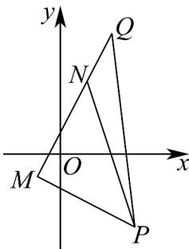

> [!faq]- 《专题07_直线交点坐标与各种距离全方位总结_九大题型__高效培优期中专》官方解析
>
> > [!success]- **【答案】** ACD
>
> > [!note]- **【分析】**
> > 根据给定条件，利用斜率坐标公式、两点间距离公式逐项分析判断·
>
> > [!note]- **【解析】**
> > 对于 $^{A}$ ，直线MP的斜率 $k_{MP}=\frac{-1-(-3)}{-1-3}=-\frac{1}{2}$ ，直线MQ的斜率 $k_{MQ}=\frac{-1-5}{-1-2}=2$ ， $k_{MP}k_{MQ} = -1$ ，即 $MP \perp MQ$ ， $\triangle MPQ$ 为直角三角形， $^{A}$ 正确；
> >
> > 对于 B，直线 MN 的斜率 $k_{MN} = \frac{-1 - 3}{-1 - 1} = 2$ ，点 M, N, Q 共线，B 错误；
> >
> > 对于 C，在 Rt△MPQ 中， $|MP|=\sqrt{4^{2}+2^{2}}=2\sqrt{5}$ ， $|PQ|=\sqrt{1^{2}+8^{2}}=\sqrt{65}$
> >
> > $\cos \angle MPQ = \frac{|MP|}{|PQ|} = \frac{2\sqrt{13}}{13}$ ，C正确；
> >
> > 对于 D， $|NQ|=\sqrt{1^{2}+2^{2}}=\sqrt{5}$ ， $S_{\triangle PQN}=\frac{1}{2}|NQ|\cdot|MP|=5$ ，D 正确.
> >
> > 故选：ACD
> >
> > 
