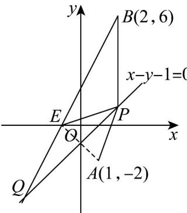

> [!faq]- 《专题07_直线交点坐标与各种距离全方位总结_九大题型__高效培优期中专》官方解析
>
> > [!success]- **【答案】** $-3\sqrt{5}$
>
> > [!note]- **【解析】**
> > 如图，设关于直线的对称点为，则 $\left\{\begin{aligned}\frac{m+1}{2}-\frac{n-2}{2}-1=0\\ \frac{n+2}{m-1}\times1=-1\end{aligned}\right.$
> >
> > 解得 $\left\{ \begin{array}{l} m = -1 \\ n = 0 \end{array} \right.$ ，则 $E(-1,0)$ ，
> >
> > 于是 $|PA| - |PB| = |PE| - |PB|$
> >
> > 结合图形知，当 $B, E, P$ 三点共线时，此时 $|PE| - |PB|$ 取得最小值 $-|BE| = -3\sqrt{5}$ ，即 $|PA| - |PB|$ 取得最小值为 $-3\sqrt{5}$
> >
> > 
> >
> > 故答案为： $-3\sqrt{5}$
