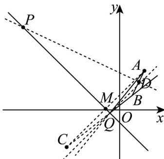

> [!faq]- 《专题07_直线交点坐标与各种距离全方位总结_九大题型__高效培优期中专》官方解析
>
> > [!success]- **【答案】** (1) $4x - 5y + 1 = 0$ (2) $\left(-\frac{15}{2},\frac{13}{2}\right);\frac{91}{4}$
>
> > [!note]- **【分析】**
> > （1）根据题意，求出点 $A$ 关于直线 $l$ 的对称点 $C$ 的坐标，反射光线为直线 $BC$ 两点式写出方程，化简整理成一般式方程；
> >
> > (2) P 点是线段 AB 的垂直平分线与 l 的交点，求出线段 AB 的垂直平分线，解方程组求交点坐标即可，设 $Q(x,y)$ ， $QA^{2} + QB^{2}$ 整理之后为 $2\left[\left(x - \frac{3}{2}\right)^{2} + (y - 2)^{2}\right] + \frac{5}{2}$ ，
> >
> > 转化为求 $\left(x - \frac{3}{2}\right)^2 + (y - 2)^2$ 的最小值，这是 $Q$ 与线段 $AB$ 中点的距离的平方，其最小值为 $D$ 到直线的距离的平方。
>
> > [!note]- **【解析】**
> > （1）如图所示：
> >
> > 
> >
> > 设线段 $AB$ 中点 $D$ ，点 $A$ 关于直线 $l$ 的对称点 $C(x', y')$ ，直线 $AC$ 与直线 $l$ 交于 $M(x_0, y_0)$
> >
> > 因为直线 AC 与直线 l 垂直，并且过点 A，
> >
> > 所以其方程为 $y - 3 = x - 2$ ，即 $x - y + 1 = 0$
> >
> > 由 $x + y + 1 = 0$ ， $x - y + 1 = 0$ ，解得 $x = -1$ ， $y = 0$ ，即 $M$ 坐标为 $(-1,0)$
> >
> > 因为 $A$ 、 $C$ 两点关于直线 $l$ 对称，所以关于点 $M$ 对称，
> >
> > 所以 $x' = 2x_{0} - 2 = 2 \times (-1) - 2 = -4$ ， $y' = 2y_{0} - 3 = 2 \times 0 - 3 = -3$
> >
> > ∴ C 点坐标为 $(-4, -3)$
> >
> > 根据光线反射定律，反射光线经过 B、C 两点，
> >
> > 由直线的两点式方程得：
> >
> > 直线 BC 方程为 $\frac{y-1}{-3-1}=\frac{x-1}{-4-1}$ ，
> >
> > 即反射光线所在直线的方程为 $4x - 5y + 1 = 0;$
> >
> > (2) 线段 $AB$ 的垂直平分线为 $m$ ，因为 $PA = PB$
> >
> > 所以点 $P$ 在直线 $m$ 上，又因为点 $P$ 在直线 $l$ 上，
> >
> > 所以点 P 为直线 l 与 m 交点，
> >
> > 由 $B(1,1)$ ， $A(2,3)$ 的坐标可知，
> >
> > 线段 $_{AB}$ 中点 $D\left(\frac{3}{2},2\right)$ ，直线 $_{AB}$ 斜率为 $k=\frac{3-1}{2-1}=2$
> >
> > 所以其垂直平分线 m 斜率 $k' = -\frac{1}{2}$ ，
> >
> > 因其经过点 D，由直线的点斜式方程得直线 m 的方程为
> >
> > $y-2=-\frac{1}{2}\left(x-\frac{3}{2}\right)$ ，即 $2x+4y-11=0$ ，
> >
> > 与直线 $l$ 的方程联立
> >
> > $$
> > \left\{ \begin{array}{l} x + y + 1 = 0 \\ 2 x + 4 y - 1 1 = 0 \end{array} \right.
> > $$
> >
> > 解方程组得 $_{P}$ 点坐标为 $\left(-\frac{15}{2},\frac{13}{2}\right)$ ;
> >
> > 设点 Q 坐标为 $(x, y)$ ，令 $u = QA^{2} + QB^{2}$
> >
> > 则 $u = (x - 2)^{2} + (y - 3)^{2} + (x - 1)^{2} + (y - 1)^{2}$
> >
> > $$
> > = 2 \left(x ^ {2} - 3 x + y ^ {2} - 4 y\right) + 1 5
> > $$
> >
> > $$
> > = 2 \left[ \left(x - \frac {3}{2}\right) ^ {2} + (y - 2) ^ {2} \right] + \frac {5}{2},
> > $$
> >
> > 要使 $u$ 最小，则当且仅当 $\left(x - \frac{3}{2}\right)^2 + (y - 2)^2$ 最小，
> >
> > $\left(x - \frac{3}{2}\right)^2 + (y - 2)^2$ 可表示为点 $Q(x, y)$ 到点 $D\left(\frac{3}{2}, 2\right)$ 的距离的平方，当 $QD \perp l$ ，即计算点 $D$ 到直线 $l$ 的距离时取到最小值，此时 $DQ$ 是点 $D$ 到直线 $l$ 的距离，由点到直线距离公式得 $DQ_{min} = \frac{\left|\frac{3}{2} + 2 + 1\right|}{\sqrt{1^2 + 1^2}} = \frac{9}{2\sqrt{2}}$ ，所以 $u_{\min} = 2\left(\frac{9}{2\sqrt{2}}\right)^2 + \frac{5}{2} = \frac{91}{4}$
