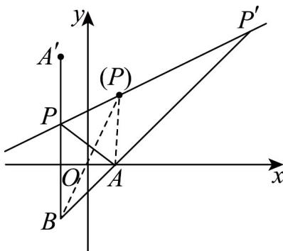
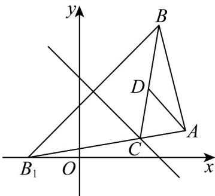
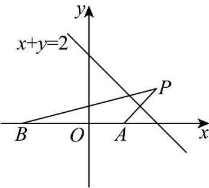

> [!faq]- 《专题07_直线交点坐标与各种距离全方位总结_九大题型__高效培优期中专》官方解析
>
> > [!success]- **【答案】** AC
>
> > [!note]- **【分析】**
> > 应用点关于直线对称，结合饮马模型求 $\left|PA\right|+\left|PB\right|$ 的最小值，利用三角形的三边关系及点线位置关系求 $\left|PA\right|-\left|PB\right|$ 的最值，即可得答案·
>
> > [!note]- **【解析】**
> > 令是关于的对称点，则 $\left\{\begin{aligned}\frac{b}{a-2}&=-2\\ \frac{a+2}{2}&-2\times\frac{b}{2}+8=0\end{aligned}\right.$
> >
> > 所以 $a = -2, b = 8$ ，即 $A'(-2, 8)$ ， $P$ 为 $A'B$ 与 $l$ 的交点，
> >
> > 如下图 $\left|PA'\right|=\left|PA\right|$ ，则 $\left|PA\right|+\left|PB\right|=\left|PA'\right|+\left|PB\right|\quad\left|A'B\right|=12$
> >
> > 当且仅当 $B, P, A'$ 共线且 $P$ 在线段 $A'B$ 上时取等号，即 $\left|PA\right| + \left|PB\right|$ 的最小值为 12；
> >
> > 由图知 $-|AB| \leq |PA| - |PB| < |AB|$ （直线 $AB$ 与直线 $l$ 的交点离 $A$ 点更近），即 $-4\sqrt{2} \leq |PA| - |PB| < 4\sqrt{2}$ ，当且仅当 $B, P', A$ 共线且 $P'$ 在射线 $BA$ 上时取最小值，但无最大值，即最小值是 $|P'A| - |P'B|$ ，为 $-4\sqrt{2}$ 故选：AC
> >
> > 
> >
> > 42．2023年暑期档动画电影《长安三万里》重新点燃了人们对唐诗的热情，出塞诗是唐代汉族诗歌的主要题材，是唐诗当中思想性最深刻，想象力最丰富，艺术性最强的一部分，唐代诗人李颀的边塞诗《古从军行》开头两句说：“白日登山望烽火，黄昏饮马傍交河”。诗中隐含着一个有趣的数学问题——“将军饮马”，即将军在观望烽火之后从山脚下某处出发，先到河边饮马后再回军营，怎样走才能使总路程最短？在平面直角坐标系中，设将军的出发点是 $A(4,1)$ ，军营所在位置为 $B(3,5)$ ，河岸线所在直线的方程为 $x+y-3=0$
> >
> > (1)求将军从出发点到河边饮马，再回到军营（“将军饮马”）的最短总路程；
> >
> > (2)设“将军饮马”路程最短时的饮马点为 $C$ ，在 $\triangle ABC$ 中，求 $BC$ 边中线所在的直线方程.
> >
> > 【答案】(1) $\sqrt{37}$
> >
> > (2) $26x + 19y - 123 = 0$
> >
> > 【分析】（1）根据点关于直线对称可得对称点 $B_{1}(-2,0)$ ，即可根据两点距离公式求解，
> >
> > (2) 根据两直线的方程可得交点 $C\left(\frac{16}{7}, \frac{5}{7}\right)$ ，即可根据中点坐标可得 $D\left(\frac{37}{14}, \frac{20}{7}\right)$ ，进而根据两点坐标求解直线方程：
> >
> > 【详解】（1）由题意可知 $A, B$ 在 $x + y - 3 = 0$ 的同侧，
> >
> > 设点 B 关于直线 $x + y - 3 = 0$ 的对称点为 $B_{1}(a, b), A, C, B_{1}$ 三点共线满足题意，点 C 为使得总路程最短的“最佳饮水点”，
> >
> > 则 $\left\{ \begin{array}{l} \frac{a + 3}{2} + \frac{b + 5}{2} - 3 = 0 \\ \frac{b - 5}{a - 3} \times (-1) = -1 \end{array} \right.$ ，解得 $\left\{ \begin{array}{ll} a = -2 & \text{即} \\ b = 0 & B_1(-2,0) \end{array} \right.$ ，
> >
> > 此时“将军饮马”走过的总路程为 $\left|AC\right| + \left|CB\right| = \left|AC\right| + \left|CB_1\right| = \left|AB_1\right| = \sqrt{6^2 + 1^2} = \sqrt{37}$
> >
> > 
> >
> > (2) 由 (1) 知 $k_{AB_1} = \frac{1}{4 + 2} = \frac{1}{6}$ , 故直线方程为 $y = \frac{1}{6}(x + 2)$ ,
> >
> > 故直线 $AB_{1}$ 的方程是 $x - 6y + 2 = 0$
> >
> > 联立 $\left\{ \begin{array}{l} x - 6y + 2 = 0 \\ x + y - 3 = 0 \end{array} \right.$ ，解得 $\left\{ \begin{array}{l} x = \frac{16}{7} \\ y = \frac{5}{7} \end{array} \right.$ ，即将军在河边饮马的地点的坐标为 $C\left(\frac{16}{7}, \frac{5}{7}\right)$ ，
> >
> > 边 $BC$ 的中点 $D(x,y)$ ，则 $x = \frac{3 + \frac{16}{7}}{2} = \frac{37}{14}, y = \frac{5 + \frac{5}{7}}{2} = \frac{20}{7}$ ，即 $D\left(\frac{37}{14}, \frac{20}{7}\right)$ ，
> >
> > ∴直线斜率 $k=\frac{1-\frac{20}{7}}{4-\frac{37}{14}}=-\frac{26}{19}$ ，
> >
> > ∴直线 AD 的方程为 $y-1=-\frac{26}{19}(x-4)$ ，整理得 $26x+19y-123=0$ 。
> >
> > $\therefore \triangle ABC$ 中 $BC$ 边中线所在的直线方程为 $26x + 19y - 123 = 0$
> >
> > 43. 唐代诗人李颀的诗《古从军行》开头两句说：“白日登山望烽火，黄昏饮马傍交河”，诗中隐含着一个有趣的数学问题——“将军饮马”问题，即将军在观望烽火之后从山脚下某处出发，先到河边饮马后再回到军营，怎样走才能使总路程最短？在平面直角坐标系中，设军营所在的位置为 $B(-2,0)$ ，若将军从山脚下的点 $A(1,0)$ 处出发，河岸线所在直线的方程为 $x + y = 2$ ，则“将军饮马”的最短总路程为（）A. $\sqrt{29}$ B.5 C. $\sqrt{17}$ D. $\sqrt{15}$
> >
> > 【答案】C
> >
> > 【分析】作点 $A(1,0)$ 关于直线 $x + y = 2$ 的对称点为 $P(x,y)$ ，则最短路程为 $BP$ 。根据点关于直线的对称问题，列方程组，可求得 $P(2,1)$ ，再应用两点间的距离公式求 $|BP|$ 即可。
> >
> > 【详解】如图，作点 $A(1,0)$ 关于直线 $x + y = 2$ 的对称点为 $P(x,y)$
> >
> > 
> >
> > 则 $\left\{ \begin{array}{l} \frac{1 + x}{2} + \frac{y}{2} = 2 \\ \frac{y - 0}{x - 1} \cdot (-1) = -1 \end{array} \right.$ ，解得 $\left\{ \begin{array}{l} x = 2 \\ y = 1 \end{array} \right.$ ，
> >
> > 所以 $P(2,1)$ .
> >
> > 则“将军饮马”的最短总路程为 $\left|BP\right| = \sqrt{\left(2 + 2\right)^2 + \left(1 - 0\right)^2} = \sqrt{17}$ .
> >
> > 故选 **C**.
