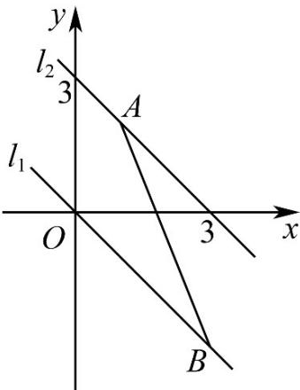

## 考点01 由直线交点的个数求参数

1．直线 $x + y + b = 0$ 与线段 AB 没有公共点，其中 $A(1,2)$ ， $B(3,-3)$ ，则实数 b 的取值范围是 \_\_\_\_。

【答案】 $(-∞,-3)∪(0,+∞)$

【分析】数形结合即可求得 $b$ 的取值范围·

【详解】由题可知，当直线 y = -x - b 经过点 $A(1,2)$ 时 b = -3 ，

当直线 $y = -x - b$ 经过点 $B(3, - 3)$ 时 $b = 0$

当直线 $x + y + b = 0$ 与线段 $AB$ 没有公共点，

则 b < -3 或 b > 0.

故答案为： $(-∞,-3)∪(0,+∞)$ .

![[高中/课堂同步/题库/人教A版高中数学同步讲义(2026)/03_选择性必修第一册/期中专项训练+期中模拟卷/专项训练/专题07_直线交点坐标与各种距离全方位总结_九大题型__高效培优期中专/_compact/Q00062343.md]]
![[高中/课堂同步/题库/人教A版高中数学同步讲义(2026)/03_选择性必修第一册/期中专项训练+期中模拟卷/专项训练/专题07_直线交点坐标与各种距离全方位总结_九大题型__高效培优期中专/_compact/Q00062344.md]]
