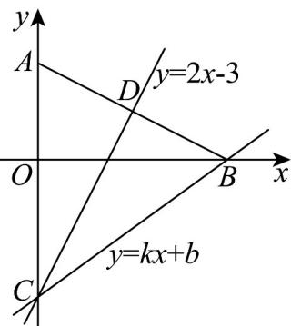

## 考点 06 点关于线对称问题

26. 将一张画有直角坐标系的图纸折叠一次，使得点 $A(0,2)$ 与点 $B(4,0)$ 重合，若此时 $y$ 轴与直线 $y = kx + b$ 也正好重合，则 $k + b = (\quad)$ . A. $-\frac{15}{4}$ B. $\frac{15}{4}$ C. $\frac{9}{4}$ D. $-\frac{9}{4}$

【答案】D

【分析】先求图纸的折痕所在的直线方程 $y = 2x - 3$ ，由题意得点 $B(4,0)$ 在直线 $y = kx + b$ 上，得 $4k + b = 0$ 又直线 $y = 2x - 3$ 与直线 $y = kx + b$ 以及 $y$ 轴相交于点 $C(0, -3)$ ，即可求 $b$ ，进而求解。

【详解】由题意有： $k_{AB}=\frac{0-2}{4-0}=-\frac{1}{2}$ ，点A,B的中点 $D(2,1)$ ，

所以图纸的折痕所在的直线方程为 $y - 1 = 2(x - 2)$ ，即 $y = 2x - 3$ ，令 $x = 0$ ，得 $y = -3$ ，即 $C(0, -3)$

又由 $y$ 轴与直线 $y = kx + b$ 也正好重合，则点 $B(4,0)$ 在直线 $y = kx + b$ 上，

所以 $4k + b = 0$

又因为直线 $y = 2x - 3$ 与直线 $y = kx + b$ 以及 $y$ 轴相交与点 $C(0, - 3)$

所以 $b = -3$ ，代入 $4k + b = 0$ ，解得 $k = \frac{3}{4}$

所以 $k + b = \frac{3}{4} - 3 = -\frac{9}{4}$

故选：D.

![[高中/课堂同步/题库/人教A版高中数学同步讲义(2026)/03_选择性必修第一册/期中专项训练+期中模拟卷/专项训练/专题07_直线交点坐标与各种距离全方位总结_九大题型__高效培优期中专/_compact/Q00062361.md]]
![[高中/课堂同步/题库/人教A版高中数学同步讲义(2026)/03_选择性必修第一册/期中专项训练+期中模拟卷/专项训练/专题07_直线交点坐标与各种距离全方位总结_九大题型__高效培优期中专/_compact/Q00062362.md]]
![[高中/课堂同步/题库/人教A版高中数学同步讲义(2026)/03_选择性必修第一册/期中专项训练+期中模拟卷/专项训练/专题07_直线交点坐标与各种距离全方位总结_九大题型__高效培优期中专/_compact/Q00062363.md]]
![[高中/课堂同步/题库/人教A版高中数学同步讲义(2026)/03_选择性必修第一册/期中专项训练+期中模拟卷/专项训练/专题07_直线交点坐标与各种距离全方位总结_九大题型__高效培优期中专/_compact/Q00062364.md]]
