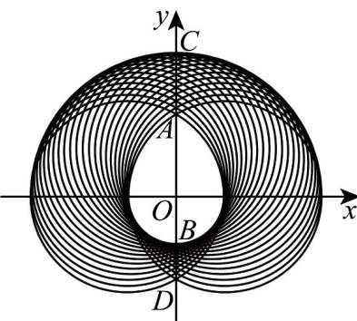

<!-- question-source:start -->
49. 已知集合 $P = \left\{(x, y) (x - \cos \theta)^2 + (y - \sin \theta)^2 = 4, 0 \leq \theta \leq \pi\right\}$ . 由集合 $P$ 中所有的点组成的图形如图中阴影部分所示，中间白色部分形如美丽的“水滴”给出下列结论，正确的有（）

A．白色“水滴”区域（含边界）任意两点间距离的最大值为 $1+\sqrt{3}$ ；
B．在阴影部分任取一点M，则M到坐标轴的距离小于等于 $^{3}$ ；
C．阴影部分的面积为 $8\pi$ ；
D．阴影部分的内外边界曲线长为 $8\pi$ .
<!-- question-source:end -->

![[高中/课堂同步/题库/人教A版高中数学同步讲义(2026)/03_选择性必修第一册/期中专项训练+期中模拟卷/专项训练/专题08_圆的两类全方位总结_九大题型__高效培优期中专项训练_高二数/_compact/answers/Q00062417A1.md]]
