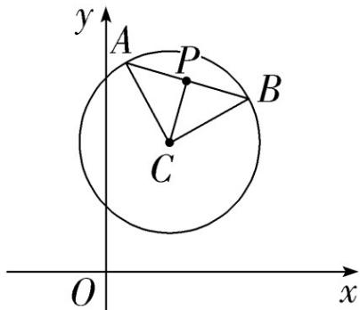

> [!faq]- 《专题08_圆的两类全方位总结_九大题型__高效培优期中专项训练_高二数》官方解析
>
> > [!success]- **【答案】** B
>
> > [!note]- **【分析】**
> > 由圆的性质，结合题意与图象，可得答案·
>
> > [!note]- **【解析】**
> > 圆 $C$ 的方程可化为 $(x - 1)^2 +(y - 2)^2 = 2$ ， $C(1,2)$ ，半径 $r = \sqrt{2}$
> >
> > 因为 $CA \perp CB$ ，所以 $\left|AB\right| = \sqrt{2} r = 2$
> >
> > 又 $P$ 是 $AB$ 的中点，所以 $\left|CP\right| = \frac{1}{2}\left|AB\right| = 1$
> >
> > 所以点 $P$ 的轨迹方程为 $(x - 1)^2 + (y - 2)^2 = 1$
> >
> > 
> >
> > 故选 **B**.
