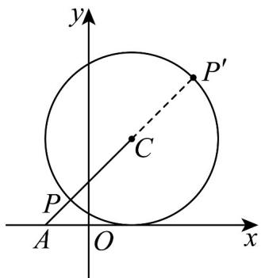

> [!faq]- 《专题08_圆的两类全方位总结_九大题型__高效培优期中专项训练_高二数》官方解析
>
> > [!success]- **【答案】** (1) $(x-1)^{2}+(y-2)^{2}=4$ (2)最小值为 $14 - 8\sqrt{2}$ ，最大值为 $14 + 8\sqrt{2}$
>
> > [!note]- **【分析】**
> > （1）设圆 $C$ 的标准方程为 $\left(x - a\right)^2 +\left(y - b\right)^2 = r^2$ ，然后代点求解即可；
> >
> > (2) 由 $x^{2} + y^{2} + 2x + 3 = (x + 1)^{2} + y^{2} + 2$ ，由于 $\sqrt{(x + 1)^{2} + y^{2}}$ 表示点 $P(x, y)$ 与 $A(-1, 0)$ 之间的距离，即 $|PA|$
> >
> > 进而结合两点间的距离公式及圆的性质求解即可·
>
> > [!note]- **【解析】**
> > （1）设圆 C 的标准方程为 $(x-a)^{2}+(y-b)^{2}=r^{2}$
> >
> > 则 $\left\{ \begin{array}{l} (1 - a)^2 + (-b)^2 = r^2 \\ (1 - a)^2 + (4 - b)^2 = r^2 \\ (3 - a)^2 + (2 - b)^2 = r^2 \end{array} \right.$ ，解得 $\left\{ \begin{array}{l} a = 1 \\ b = 2 \\ r^2 = 4 \end{array} \right.$ ，
> >
> > 所以圆 C 的标准方程为 $(x-1)^{2}+(y-2)^{2}=4$ .
> >
> > (2) 由 (1) 知，圆 C 的圆心 $C(1,2)$ ，半径 r=2，
> >
> > 由 $x^{2} + y^{2} + 2x + 3 = (x + 1)^{2} + y^{2} + 2$
> >
> > 因为 $\sqrt{(x+1)^{2}+y^{2}}$ 表示点 $P(x,y)$ 与 $A(-1,0)$ 之间的距离，即 $|PA|$
> >
> > 又 $\left|AC\right|=\sqrt{\left(-1-1\right)^{2}+\left(0-2\right)^{2}}=2\sqrt{2}$
> >
> > 所以 $\left|PA\right|_{\min}=\left|AC\right|-r=2\sqrt{2}-2,\quad\left|PA\right|_{\max}=\left|AC\right|+r=2\sqrt{2}+2$
> >
> > 则 $x^{2} + y^{2} + 2x + 3$ 的最小值为 $\left(2\sqrt{2} - 2\right)^{2} + 2 = 14 - 8\sqrt{2}$
> >
> > 最大值为 $\left(2\sqrt{2} + 2\right)^2 + 2 = 14 + 8\sqrt{2}$ .
> >
> > 
> >
> > 17. 过点 $A(-1, -1)$ , $B(0, -2)$ , $C(3, 1)$ 三点的圆的标准方程为
> >
> > 【答案】 $(x - 1)^{2} + y^{2} = 5$
> >
> > 【分析】设圆的标准方程为 $(x-a)^{2}+(y-b)^{2}=r^{2}$ ，根据条件建立方程组，联立方程求解出a,b,r，即可求解
> >
> > 【详解】设圆的标准方程为 $(x - a)^2 +(y - b)^2 = r^2$
> >
> > 因为圆过点 $A(-1,-1)$ ， $B(0,-2)$ ， $C(3,1)$ 三点，
> >
> > 所以 $(-1 - a)^2 + (-1 - b)^2 = r^2$ ①， $(-a)^2 + (-2 - b)^2 = r^2$ ②， $(3 - a)^2 + (1 - b)^2 = r^2$ ③，
> >
> > 由①-②得到a-b-1=0④，由②-③得到 $a+b-1=0$ ⑤，
> >
> > 由④⑤解得 $a = 1, b = 0$ ，代入①，得 $r^2 = 5$
> >
> > 所以圆的标准方程为 $(x - 1)^2 + y^2 = 5$
> >
> > 故答案为： $(x - 1)^2 +y^2 = 5$
