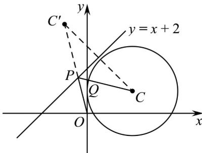

> [!faq]- 《专题08_圆的两类全方位总结_九大题型__高效培优期中专项训练_高二数》官方解析
>
> > [!success]- **【答案】** (1) $(x-2)^{2}+(y-1)^{2}=4$ (2) $(x + 1)^{2} + (y - 4)^{2} = 4$ (3) $\sqrt{17} - 2$
>
> > [!note]- **【分析】**
> > （ $^{1}$ ）设出圆的标准方程，代入点的坐标求解出参数则圆的方程可知；
> >
> > (2) 根据斜率关系和中点关系求解出对称点 $C'$ 的坐标，结合对称圆的半径不变求解出圆 $C'$ 的方程；
> >
> > （3）根据圆外一点到圆上点距离的最值可知 $\left|OP\right|+\left|PQ\right|\quad\left|OP\right|+\left|PC\right|-2$ ，然后利用对称关系将 $\left|OP\right|+\left|PC\right|$ 转化为 $\left|OP\right|+\left|PC'\right|$ ，结合三点共线可求最小值·
>
> > [!note]- **【解析】**
> > （1）设圆的方程为 $\left(x - a\right)^2 +\left(y - b\right)^2 = r^2 (r > 0)$ ，代入 $A(4,1),B(0,1),M(2,3)$
> >
> > 则 $\left\{ \begin{array}{l} (4 - a)^2 + (1 - b)^2 = r^2 \\ (-a)^2 + (1 - b)^2 = r^2 \\ (2 - a)^2 + (3 - b)^2 = r^2 \end{array} \right.$ ，解得 $\left\{ \begin{array}{l} a = 2 \\ b = 1 \\ r = 2 \end{array} \right.$ ，
> >
> > 所以圆 C 的方程为 $(x-2)^{2}+(y-1)^{2}=4$ ;
> >
> > (2) 设 $C'(m,n)$ ,
> >
> > 由对称关系可知 $\left\{ \begin{array}{l} \frac{n - 1}{m - 2} \times 1 = -1 \\ \frac{n + 1}{2} = \frac{m + 2}{2} + 2 \end{array} \right.$ ，解得 $\left\{ \begin{array}{ll} m = -1, & \text{所以} \\ n = 4 & C'(-1,4) \end{array} \right.$ ，
> >
> > 又因为对称圆的半径不变，
> >
> > 所以 $C'$ 的方程为 $(x+1)^{2}+(y-4)^{2}=4$ ;
> >
> > (3) 因为 $\left|OP\right| + \left|PQ\right|$ $\left|OP\right| + \left|PC\right| - 2$
> >
> > 由 $(2)$ 可知 C 关于直线 l 的对称点为 $C'$ ，
> >
> > 所以 $\left|OP\right|+\left|PC\right|=\left|OP\right|+\left|PC'\right|\quad\left|OC'\right|=\sqrt{1+16}=\sqrt{17}$
> >
> > 当且仅当 $O, P, C'$ 共线时取等号，
> >
> > 所以 $\left|OP\right|+\left|PQ\right|\quad\sqrt{17}-2$ ，即 $\left|OP\right|+\left|PQ\right|$ 的最小值为 $\sqrt{17}-2$
> >
> > 
> >
> > ## 考点03 圆的一般方程考点总结
