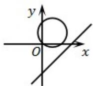
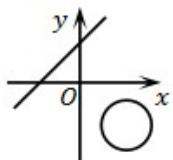
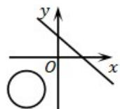
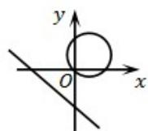

> [!faq]- 《专题08_圆的两类全方位总结_九大题型__高效培优期中专项训练_高二数》官方解析
>
> > [!success]- **【答案】** （1）证明见解析；（2） $m=\frac{2}{11}$
>
> > [!note]- **【分析】**
> > （1）圆心 $Q$ 的坐标为 $(m - 1,3m)$ ，则圆心 $Q$ 在过点 $P$ 的定直线 $y = 3x + 3$ 上；
> >
> > (2) 以 $P$ 、 $Q$ 为直径的圆过原点，则 $OP \perp OQ$ 利用斜率计算即可.
>
> > [!note]- **【解析】**
> > （1）由题可知圆心 $Q$ 的坐标为 $(m - 1,3m)$
> >
> > 令 $\left\{ \begin{array}{l}x = m - 1\\ y = 3m \end{array} \right.$ 消去 $m$ ，得 $y = 3x + 3$
> >
> > ∵直线 $y=3x+3$ 过点 $P(-2,-3)$ .
> >
> > ∴圆心Q 在过点P的定直线 $y=3x+3$ 上.
> >
> > (2)∵以P、Q为直径的圆过原点，
> >
> > $$
> > \therefore O P \perp O Q.
> > $$
> >
> > $$
> > \therefore \frac {3}{2} \cdot \frac {3 m}{m - 1} = - 1
> > $$
> >
> > $$
> > \therefore m = \frac {2}{1 1}.
> > $$
> >
> > 即当 $m = \frac{2}{11}$ 时，以 $P, Q$ 为直径的圆过原点。
> >
> > 40．直线 $l:ax-y+b=0$ ，圆 $M:x^{2}+y^{2}-2ax+2by=0$ ，则 l 与 M 在同一坐标系中的图形可能是（）
> >
> > A
> >
> > 
> >
> > B
> >
> > 
> >
> > C
> >
> > 
> >
> > D
> >
> > 
> >
> > 【答案】A
> >
> > 【分析】先求出圆 M 的圆心和半径，可排除 B，C 选项，再由圆心的位置可得其横纵坐标的正负，从而可判断直线的位置．
> >
> > 【详解】解：由 $x^{2} + y^{2} - 2ax + 2by = 0$ ，得 $(x - a)^{2} + (x + b)^{2} = a^{2} + b^{2}$
> >
> > 所以圆心 $M(a, -b)$ ，半径为 $\sqrt{a^2 + b^2}$
> >
> > 由此可知圆 M 过坐标原点，所以排除 B，C，
> >
> > 由选项A，D可知 $a > 0, b < 0$
> >
> > 所以直线 $l: ax - y + b = 0$ 过一、三、四象限，
> >
> > 故选：A.
> >
> > ## 考点05 圆中的最值问题
