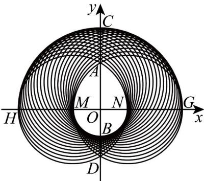

> [!faq]- 《专题08_圆的两类全方位总结_九大题型__高效培优期中专项训练_高二数》官方解析
>
> > [!success]- **【答案】** ABD
>
> > [!note]- **【分析】**
> > 由“水滴”形状性质可得其与 $y$ 轴的上下两交点之间的距离最大，可得 $\mathbf{A}$ 正确；利用圆的参数方程以及三角函数值域可得 $\mathbf{B}$ 正确；由阴影面积形状并利用割补法求出阴影部分面积，可判断 $\mathbf{C}$ 错误；利用弧长公式计算可得 $\mathbf{D}$ 正确·
>
> > [!note]- **【解析】**
> > 对于 $^{A}$ ，由于 $(x-\cos\theta)^{2}+(y-\sin\theta)^{2}=4$ ，令x=0时，整理得 $2\sin\theta=y-\frac{3}{y}\in[0,2]$ ，
> >
> > 解得 $y \in [-\sqrt{3}, -1] \cup [\sqrt{3}, 3]$ ，“水滴”图形与 $y$ 轴相交，最高点记为 $A$ ，
> >
> > 则点 A 的坐标为 $(0, \sqrt{3})$ ，点 $B(0, -1)$
> >
> > 白色“水滴”区域（含边界）任意两点间距离的最大值为 $\left|AB\right|=1+\sqrt{3}$ ，故 A 正确；
> >
> > 对于 ${}^{\mathrm{B}}$ ，由于 $(x - \cos \theta)^2 +(y - \sin \theta)^2 = 4$ ，整理得： $\left\{ \begin{array}{l}x = 2\cos \alpha +\cos \theta \\ y = 2\sin \alpha +\sin \theta \end{array} \right.$
> >
> > 所以 $M(2\cos \alpha +\cos \theta ,2\sin \alpha +\sin \theta)$ ，所以 $M$ 到坐标轴的距离为 $\left|2\cos \alpha +\cos \theta \right|$ 或 $\left|2\sin \alpha +\sin \theta \right|$
> >
> > 因为 $\cos \theta \in [-1,1],\sin \theta \in [0,1]$
> >
> > 所以 $|2\cos \alpha +\cos \theta |\leq |2\cos \alpha | + |\cos \theta |\leq 2 + 1 = 3$ ， $|2\sin \alpha +\sin \theta |\leq |2\sin \alpha | + |\sin \theta |\leq 2 + 1 = 3$
> >
> > 所以 M 到坐标轴的距离小于等于 $^{3}$ ，故 B 正确；
> >
> > 对于 $C$ ，由于 $(x - \cos \theta)^2 +(y - \sin \theta)^2 = 4$ ，令 $y = 0$ 时，整理得 $2\cos \theta = y - \frac{3}{y}\in [-2,2]$
> >
> > 解得 $x \in [-3, -1] \cup [1, 3]$ ，
> >
> > 因为 $(x - \cos \theta)^2 + (y - \sin \theta)^2 = 4$ 表示以 $Q(\cos \theta, \sin \theta)$ 为圆心，半径为 $r = 2$ 的圆，
> >
> > 则 $1 = r - |OQ| \leq |OP| \leq |OQ| + r = 3$
> >
> > 且 $0 \leq \theta \leq \pi$ ，则 $Q(\cos \theta, \sin \theta)$ 在 $x$ 轴上以及 $x$ 轴上方，
> >
> > 故白色“水滴”的下半部分的边界为以 $O$ 为圆心，半径为 $1$ 的半圆，阴影的上半部分的外边界是以 $O$ 为圆心
> >
> > 半径为 $^{3}$ 的半圆，
> >
> > 根据对称可知：白色“水滴”在第一象限的边界是以以 $M(-1,0)$ 为圆心，半径为2的圆弧，
> >
> > 设 $N(1,0)$ ，则 $\left|AN\right| = \left|AM\right| = \left|M N\right| = 2$ ，即 $\square_{AN}$ 所对的圆心角为 $\frac{\pi}{3}$ ，
> >
> > 同理 $\frac{1}{AM}$ 所在圆的半径为 $2$ ，所对的圆心角为 $\frac{\pi}{3}$
> >
> > 阴影部分在第四象限的外边界为以 $N(1,0)$ 为圆心，半径为 $^2$ 的圆弧，
> >
> > 设 $G(3,0), H(-3,0)$ ，可得 $|ON| = 1, |OD| = \sqrt{3}, \angle OND = \frac{\pi}{3}$ ， $DG$ 所对的圆心角为 $\frac{2\pi}{3}$ ，
> >
> > 同理 DH 所在圆的半径为 $^{2}$ ，所对的圆心角为 $\frac{2\pi}{3}$ ，
> >
> > 
> >
> > 故白色“水滴”图形由一个等腰三角形，两个全等的弓形，和一个半圆组成，
> >
> > 所以它的面积是 $S = S_{\text{半圆}} + 2S_{\text{弓形}} + S_{\triangle} = \frac{1}{2}\times \pi \times 1^{2} + 2\times \left(\frac{2\pi}{3} -\sqrt{3}\right) + \frac{1}{2}\times 2\times \sqrt{3} = \frac{11\pi}{6} -\sqrt{3}.$ $x$ 轴上方的半圆（包含阴影和水滴的上半部分）的面积为 $\frac{1}{2}\pi \times 3^2 = \frac{9}{2}\pi$
> >
> > 第四象限的阴影和水滴部分面积可以看作是一个直角三角形和一个扇形的面积的和，且等于 $\frac{1}{3} \times \pi \times 2^2 + \frac{1}{2} \times \sqrt{3} \times 1 = \frac{4}{3} \pi + \frac{\sqrt{3}}{2}$ ，
> >
> > 所以阴影部分的面积为 $\frac{9}{2}\pi + 2\left(\frac{4}{3}\pi + \frac{\sqrt{3}}{2}\right) - \frac{11}{6}\pi + \sqrt{3} = \frac{16}{3}\pi + 2\sqrt{3}$ ，故 $C$ 错误；
> >
> > 对于 D，x 轴上方的阴影部分的内外边界曲线长为 $\frac{1}{2} \times 2\pi \times 3 + \frac{\pi}{3} \times 2 \times 2 = 3\pi + \frac{4}{3}\pi = \frac{13}{3}\pi$ ，
> > x 轴下方的阴影部分的内外边界曲线长为 $\frac{1}{2} \times 2\pi \times 1 + (\frac{1}{2} \times 2\pi \times 2 - \frac{1}{3}\pi \times 2) \times 2 = \frac{11}{3}\pi$
> >
> > 所以阴影部分的内外边界曲线长为 $\frac{13\pi}{3} +\frac{11\pi}{3} = 8\pi$ ，故D正确·
> >
> > 故选 **ABD**.
