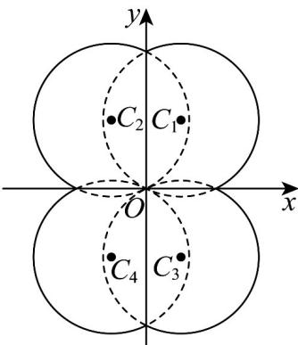
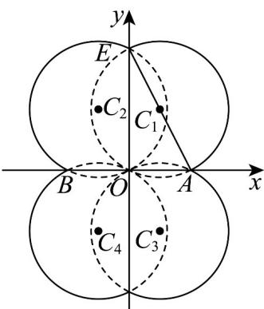
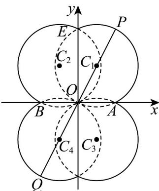
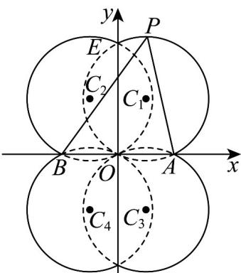

> [!faq]- 《专题08_圆的两类全方位总结_九大题型__高效培优期中专项训练_高二数》官方解析
>
> > [!success]- **【答案】** ABC
>
> > [!note]- **【分析】**
> > 化简曲线方程，并作出大致图像，由图像可判断曲线 C 是否为中心对称图形；
> >
> > 由对称性可先求其 $\frac{1}{4}$ 的面积再得到图形总面积；借助图像找到曲线上距离最大的两个点并求出距离；由图像找到使得 $\triangle ABP$ 取面积最大值的点 $P$ 的位置，并求出点 $P$ 的纵坐标的绝对值，然后求得此时 $\triangle ABP$ 的面积
>
> > [!note]- **【解析】**
> > $C:x^{2} + y^{2} = 2|x| + 4|y|$ 即 $\left|x\right|^2 -2\left|x\right| + \left|y\right|^2 -4\left|y\right| = 0$
> >
> > 则 $\left(|x| - 1\right)^2 +\left(|y| - 2\right)^2 = 5$ ，即 $\left\{ \begin{array}{ll}\left(x - 1\right)^2 +\left(y - 2\right)^2 = 5,\left( \begin{array}{ll}x & 0,y\\ 0 & 0 \end{array} \right)\\ \left(x + 1\right)^2 +\left(y - 2\right)^2 = 5,\left( \begin{array}{ll}x <   0,y & 0 \end{array} \right)\\ \left(x - 1\right)^2 +\left(y + 2\right)^2 = 5,\left( \begin{array}{ll}x & 0,y <   0 \end{array} \right)\\ \left(x + 1\right)^2 +\left(y + 2\right)^2 = 5,\left( \begin{array}{ll}x <   0,y <   0 \end{array} \right) \end{array} \right.,$
> >
> > 曲线 C 是四个圆组合成图形，如图：
> >
> > 
> >
> > 由图可知曲线 C 是中心对称图形， $^{A}$ 选项正确；
> >
> > 如图， $\because \angle EOA = \frac{\pi}{2}$ ， $\therefore AE$ 为圆的直径， $\because C_1(1,2)$ ， $\therefore E(0,4), A(2,0)$ ，
> >
> > ∴曲线 $C$ 圈成图形的面积为 $4 \times \left( \frac{S_{\text{圆}C_1}}{2} + S_{\triangle AOE} \right) = 4 \times \left( \frac{5\pi}{2} + \frac{2 \times 4}{2} \right) = 10\pi + 16$ ，B 选正确；
> >
> > 
> >
> > 如图，当且仅当 $P, Q$ 两点与所在弧对应圆心四点在同一直线上时， $PQ$ 距离最大，
> >
> > 
> >
> > 由解析式可知： $C_{1}(1,2)$ , $C_{2}(-1,-2)$
> >
> > ∴最大值为 $2r + \left|C_{1}C_{2}\right| = 2\sqrt{5} + \sqrt{\left[1 - (-1)\right]^{2} + \left[2 - (-2)\right]^{2}} = 4\sqrt{5}$ ，C选项正确；
> >
> > 如图：当 $P$ 在曲线的最高点或最低点是三角形ABP面积最大，即 $\left|y_p\right| = 2 + \sqrt{5}$
> >
> > 
> >
> > 又 $B(-2,0)$ ， $A(2,0)$
> >
> > $\therefore S_{\triangle ABP}=\frac{1}{2}\left|AB\right|\cdot\left|y_{P}\right|=4+2\sqrt{5}$ ，D选项错误.
> >
> > 故选：ABC.
> >
> > ## 考点06 圆中参数范围问题
