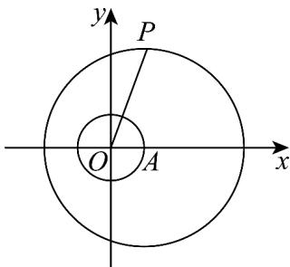

> [!faq]- 《专题08_圆的两类全方位总结_九大题型__高效培优期中专项训练_高二数》官方解析
>
> > [!success]- **【答案】** [1,3]
>
> > [!note]- **【分析】**
> > 记 $O$ 为坐标原点，作出图形，求出 $\left|OP\right|$ 的取值范围，即可得出 $\min (C,P) = |OP| - 1$ 的取值范围.
>
> > [!note]- **【解析】**
> > 记 O 为坐标原点，圆 C 的圆心为原点，圆 C 的半径为 1，
> >
> > 
> >
> > 由圆的几何性质可知， $\min (C,P) = |OP| - 1$
> >
> > 且 $\left|AP\right|-\left|OA\right|\leq\left|OP\right|\leq\left|AP\right|+\left|OA\right|$ ，即 $3-1\leq\left|OP\right|\leq3+1$ ，即 $2\leq\left|OP\right|\leq4$
> >
> > 当且仅当点 $P(-2,0)$ 时， $|OP|$ 取最小值，当且仅当点 $P(4,0)$ 时， $|OP|$ 取最大值，故 $\min(C,P) = |OP| - 1 \in [1,3]$ .
> >
> > 故答案为： $[1,3]$
