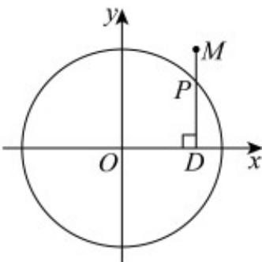

<!-- question-source:start -->
32. (1) 求经过 $P\left(-2\sqrt{3}, 1\right), Q\left(\sqrt{3}, -2\right)$ 两点的椭圆的标准方程；

(2) 如图， $DP \perp x$ 轴，垂足为 D，点 M 在 DP 的延长线上，且 $\frac{|DM|}{|DP|} = \frac{4}{3}$ ，当 P 点在圆 $x^{2} + y^{2} = 9$ 上运动时，点 M 的轨迹为曲线 C，求曲线 C 的方程。

<!-- question-source:end -->

![[高中/课堂同步/题库/人教A版高中数学同步讲义(2026)/03_选择性必修第一册/期中专项训练+期中模拟卷/专项训练/专题10_椭圆标准方程及其性质全方位总结_九大题型__高效培优期中专项/_compact/answers/Q00062457A1.md]]
