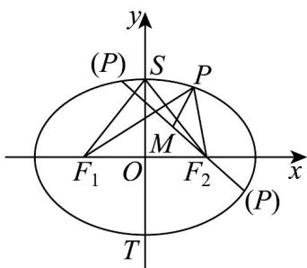

> [!faq]- 《专题10_椭圆标准方程及其性质全方位总结_九大题型__高效培优期中专项》官方解析
>
> > [!success]- **【答案】** BCD
>
> > [!note]- **【分析】**
> > 根据焦点三角形面积的相关结论即可判断 $^{A}$ ；结合椭圆性质可判断 $^{B}$ ；结合椭圆定义可求线段和差的最值，判断CD.
>
> > [!note]- **【解析】**
> > A选项：由椭圆方程 $\frac{x^2}{8} +\frac{y^2}{4} = 1$ ，所以 $a^2 = 8$ ， $b^{2} = 4$ ，所以 $c^2 = a^2 -b^2 = 4$
> >
> > 所以 $\triangle F_{1}PF_{2}$ 的面积为 $S = b^{2} \tan \frac{\angle F_{1}PF_{2}}{2} = 4$ ，故 A 错误；
> >
> > B 选项：当 $PF_{1} \perp F_{1}F_{2}$ 或 $PF_{2} \perp F_{1}F_{2}$ 时 $\triangle F_{1}PF_{2}$ 为直角三角形，这样的点 $P$ 有4个，
> >
> > 设椭圆的上下顶点分别为 S，T，则 $\left|F_{1}F_{2}\right|=4$ ， $\left|OS\right|=2$ ， $\therefore\left|OS\right|=\frac{1}{2}\left|F_{1}F_{2}\right|$ ，同理 $\left|OT\right|=\frac{1}{2}\left|F_{1}F_{2}\right|$ ，知 $\angle F_{1}SF_{2}=\angle F_{1}TF_{2}=90^{\circ}$ ，所以当 P 位于椭圆的上、下顶点时 $\triangle F_{1}PF_{2}$ 也为直角三角形，
> >
> > 其他位置不满足，满足条件的点 $P$ 有6个，故 $\mathbf{B}$ 正确；
> >
> > C 选项：由于 $\left|PF_{1}\right|-2\left|PF_{2}\right|=2a-\left|PF_{2}\right|-2\left|PF_{2}\right|=4\sqrt{2}-3\left|PF_{2}\right|$
> >
> > 所以当 $\left|PF_{2}\right|$ 最小即 $\left|PF_{2}\right|=a-c=2\sqrt{2}-2$ 时， $\left|PF_{1}\right|-2\left|PF_{2}\right|$ 取得最大值 $6-2\sqrt{2}$ ，故C正确；
> >
> > D 选项：因为 $\left|PF_{1}\right|+\left|PM\right|=2a-\left|PF_{2}\right|+\left|PM\right|=4\sqrt{2}+\left|PM\right|-\left|PF_{2}\right|$
> >
> > 
> >
> > 又 $\left\| PM\right| - \left|PF_2\right|\leq \left|MF_2\right| = \frac{\sqrt{5}}{2}$
> >
> > $\left|PF_{1}\right| + \left|PM\right|$ 的最大、最小值分别为 $4\sqrt{2} + \frac{\sqrt{5}}{2}$ 和 $4\sqrt{2} - \frac{\sqrt{5}}{2}$ ，
> >
> > 当点 P 位于 $MF_{2}$ 的延长线上时取最大值，
> >
> > 当 $P$ 位置 $F_{2}M$ 的延长线上时取最小值，故 $\mathbb{D}$ 正确·
> >
> > 故选 **BCD**
