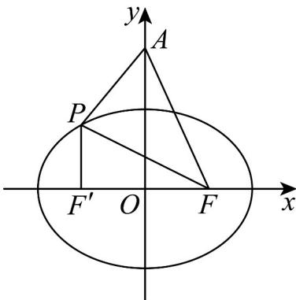

> [!faq]- 《专题10_椭圆标准方程及其性质全方位总结_九大题型__高效培优期中专项》官方解析
>
> > [!success]- **【答案】** B
>
> > [!note]- **【分析】**
> > 利用椭圆的定义，进行合理转化，求得周长最大值即可·
>
> > [!note]- **【解析】**
> > 由椭圆方程 $\frac{x^2}{9} +\frac{y^2}{5} = 1$ 得 $a = 3$ ， $b = \sqrt{5}$ ， $c = \sqrt{a^2 - b^2} = 2$
> >
> > 设椭圆的左焦点为 $F'$
> >
> > 
> >
> > $$
> > \because A (0, 2 \sqrt {3}), F ^ {\prime} (- 2 0), F (2 0)
> > $$
> >
> > $\therefore \left|AF^{\prime}\right| = \left|AF\right| = 4$
> >
> > 则 $\triangle APF$ 的周长为 $|AF| + |AP| + |PF| = |AF| + |AP| + 2a - |PF'|$
> >
> > $$
> > = 4 + 6 + \left| A P \right| - \left| P F ^ {\prime} \right| \leq 1 0 + \left| A F ^ {\prime} \right| = 1 4
> > $$
> >
> > 当且仅当 $A, P, F'$ 三点共线，且 P 在 $AF'$ 的延长线上时取等号·
> >
> > $\therefore \triangle APF$ 的周长最大值为14.
> >
> > 故选 **B**.
