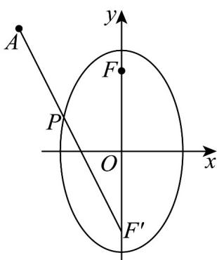

> [!faq]- 《专题10_椭圆标准方程及其性质全方位总结_九大题型__高效培优期中专项》官方解析
>
> > [!success]- **【答案】** D
>
> > [!note]- **【分析】**
> > 利用椭圆的定义，将问题化为 $\left|PF'\right| + \left|PA\right|$ 的最小值，数形结合即可得解
>
> > [!note]- **【解析】**
> > 
> >
> > 由题意， $F(0,1)$ 为一个焦点，另一焦点为 $F'(0,-1)$ ，且 $\left|PF\right| + \left|PF'\right| = 4$ ；
> >
> > 因为 $\frac{9}{4} +\frac{9}{3} >1$ ，所以 $A$ 在椭圆外部，所以 $\left|PF\right| - \left|PA\right| = 4 - \left(\left|PF^{\prime}\right| + \left|PA\right|\right)$ ，即求 $\left|PF^{\prime}\right| + \left|PA\right|$ 的最小值；由于 $\left|PF^{\prime}\right| + \left|PA\right|\quad \left|AF^{\prime}\right| = 5$ ，当 $P, F', A$ 三点共线时取等号；
> > 所以 $\left|PF\right| - \left|PA\right|$ 的最大值为-1；
> >
> > 故选 **D**.
