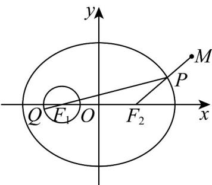

> [!faq]- 《专题10_椭圆标准方程及其性质全方位总结_九大题型__高效培优期中专项》官方解析
>
> > [!success]- **【答案】** B
>
> > [!note]- **【分析】**
> > 由题意得圆 $(x+3)^{2}+y^{2}=1$ 的圆心是椭圆的左焦点， $\left|MF_{2}\right|=6$ ，利用椭圆的定义，结合图象得到 $\left|PQ\right|\leq11-\left|PF_{2}\right|$ ，然后由 $\left|PQ\right|-\left|PM\right|\leq11-\left|MF_{2}\right|$ 即可求出 $\left|PQ\right|-\left|PM\right|$ 的最大值.
>
> > [!note]- **【解析】**
> > 如图，
> >
> > 
> >
> > 由 $\frac{x^2}{25} +\frac{y^2}{16} = 1$ ，得 $a = 5$ ， $b = 4$ ，则 $c = \sqrt{a^2 - b^2} = 3$
> >
> > 则圆 $(x + 3)^2 + y^2 = 1$ 的圆心是椭圆的左焦点 $F_{1}(-3,0)$ ，椭圆的右焦点为 $F_{2}(3,0)$
> >
> > 由椭圆的定义得 $\left|PF_{1}\right|+\left|PF_{2}\right|=2a=10$
> >
> > 所以 $\left|PQ\right|\leq\left|PF_{1}\right|+1=10-\left|PF_{2}\right|+1=11-\left|PF_{2}\right|$
> >
> > 又 $\left|MF_2\right| = \sqrt{(6 - 3)^2 + (3\sqrt{3} - 0)^2} = 6$
> >
> > 所以 $\left|PQ\right|-\left|PM\right|\leq11-\left|PF_{2}\right|-\left|PM\right|=11-\left(\left|PF_{2}\right|+\left|PM\right|\right)\leq11-\left|MF_{2}\right|=11-6=5$ 当且仅当 $P$ 为线段 $MF_{2}$ 与椭圆的交点，且 $Q$ 为射线 $PF_{1}$ 与圆的交点且 $PF_{1}$ 、 $F_{1}Q$ 方向相同时，上述不等式中的两个等号同时成立，故 $\left|PQ\right| - \left|PM\right|$ 的最大值为5.
> >
> > 故选 **B**.
