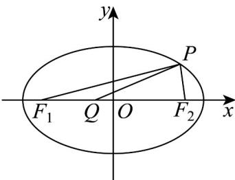

> [!faq]- 《专题10_椭圆标准方程及其性质全方位总结_九大题型__高效培优期中专项》官方解析
>
> > [!success]- **【答案】** B
>
> > [!note]- **【分析】**
> > 利用椭圆的定义式，将 $\left|PF_{2}\right|+\left|PQ\right|$ 转化为 $10+\left|PQ\right|-\left|QF_{1}\right|$ ，结合图形分析判断得出 $\left|PQ\right|-\left|PF_{1}\right|$ 的最小值，即得 $\left|PF_{2}\right|+\left|PQ\right|$ 的最小值.
>
> > [!note]- **【解析】**
> > 
> >
> > 如图，连接 $PF_{1}$ ，因 $|PF_{2}| + |PF_{1}| = 2a = 10$ ，则 $|PF_{2}| + |PQ| = 10 + |PQ| - |PF_{1}|$ ，由图知，当 $P, Q, F_{1}$ 三点共线，且点 $Q$ 在 $P, F_{1}$ 之间时， $|PQ| - |PF_{1}|$ 的值最小，最小值为 $-|QF_{1}| = -(-1 + 4) = -3$ ，此时， $|PF_{2}| + |PQ|$ 的最小值为 $10 - 3 = 7$ 。
> >
> > 故选 **B**.
