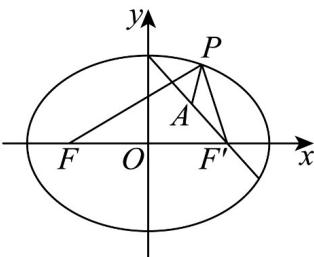

> [!faq]- 《专题10_椭圆标准方程及其性质全方位总结_九大题型__高效培优期中专项》官方解析
>
> > [!success]- **【答案】** $6+\sqrt{5}/\sqrt{5}+6$
>
> > [!note]- **【分析】**
> > 由方程得出椭圆的右焦点为 $F'(2,0)$ ，根据椭圆的定义得出 $|PA| + |PF| = 6 + |PA| - |PF'|$ ，结合图象求出 $|PA| - |PF'|$ 的最大值，即可得出答案。
>
> > [!note]- **【解析】**
> > 椭圆 $\frac{x^2}{9} +\frac{y^2}{5} = 1$ ，则 $a = 3$ ， $b = \sqrt{5}$ ， $c = \sqrt{9 - 5} = 2$
> >
> > 如图，椭圆的右焦点为 $F^{\prime}(2,0)$
> >
> > 
> >
> > 则 $|PF| + |PF'| = 2a = 6$
> >
> > $\therefore |PA| + |PF| = |PA| + 6 - |PF'| = 6 + |PA| - |PF'|$
> >
> > 由图结合三角形两边之差小于第三边，则 $\left\| PA\right| - \left|PF'\right|\leq \left|AF'\right| = \sqrt{(1 - 2)^2 + 2^2} = \sqrt{5}$
> >
> > 则当点 $P$ 在射线 $AF'$ 与椭圆的交点 $P'$ 时， $|PA| - |PF'|$ 取最大值 $\sqrt{5}$
> >
> > $\therefore |PA| + |PF|$ 的最大值为 $6 + \sqrt{5}$
> >
> > 故答案为： $6 + \sqrt{5}$
