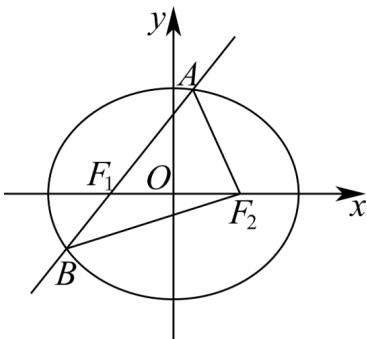

> [!faq]- 《专题10_椭圆标准方程及其性质全方位总结_九大题型__高效培优期中专项》官方解析
>
> > [!success]- **【答案】** A
>
> > [!note]- **【分析】**
> > 根据椭圆的定义求解即可·
>
> > [!note]- **【解析】**
> > 椭圆方程 $\frac{x^2}{4} +\frac{y^2}{3} = 1$ ，得： $a^2 = 4$ ，则 $a = 2$
> >
> > 由椭圆的定义得 $\left|AF_{1}\right|+\left|AF_{2}\right|=2a=4,\left|BF_{1}\right|+\left|BF_{2}\right|=4$
> >
> > 所以 $\triangle ABF_{2}$ 的周长为 $\left|AB\right| + \left|AF_{2}\right| + \left|BF_{2}\right| = \left|AF_{1}\right| + \left|AF_{2}\right| + \left|BF_{1}\right| + \left|BF_{2}\right| = 8$
> >
> > 故选：A.
> >
> > 
