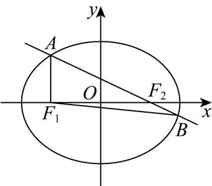

> [!faq]- 《专题10_椭圆标准方程及其性质全方位总结_九大题型__高效培优期中专项》官方解析
>
> > [!success]- **【答案】** $\frac{x^{2}}{25}+\frac{y^{2}}{15}=1$
>
> > [!note]- **【分析】**
> > 由 $\left|AF_{2}\right|=3\left|F_{2}B\right|$ 、 $\left|AB\right|=2\left|AF_{1}\right|$ 及椭圆定义，可得 $\left|AF_{2}\right|=\frac{6}{5}a$ ， $\left|AF_{1}\right|=\frac{4}{5}a$ ， $\left|AB\right|=\frac{8}{5}a$ ， $\left|BF_{1}\right|=\frac{8}{5}a$
> >
> > 再由余弦定理可得 $5c^{2}=2a^{2}$ ，又三角形 $ABF_{1}$ 的面积为 $4\sqrt{15}$ ，可求得 $a^{2}=25$ ，进而求出椭圆方程.
>
> > [!note]- **【解析】**
> > 设 $\left|BF_{2}\right|=m$ ，则 $\left|AF_{2}\right|=3m$
> >
> > 所以 $\left|AB\right|=\left|AF_{2}\right|+\left|BF_{2}\right|=4m$ ，又 $\left|AB\right|=2\left|AF_{1}\right|$
> >
> > 所以 $\left|AF_{1}\right|=2m$
> >
> > 又 $\left|AF_1\right| + \left|AF_2\right| = 2m + 3m = 5m = 2a$ ，所以 $m = \frac{2}{5} a$
> >
> > 所以 $\left|AF_2\right| = \frac{6}{5} a$ ， $\left|AF_1\right| = \frac{4}{5} a$ ， $\left|AB\right| = \frac{8}{5} a$ ， $\left|BF_1\right| = 2a - \left|BF_2\right| = 2a - m = 2a - \frac{2}{5} a = \frac{8}{5} a$
> >
> > $$
> > \cos \angle F _ {1} A B = \frac {\left| A B \right| ^ {2} + \left| A F _ {1} \right| ^ {2} - \left| B F _ {1} \right| ^ {2}}{2 \left| A B \right| \times \left| A F _ {1} \right|} = \frac {\left(\frac {8 a}{5}\right) ^ {2} + \left(\frac {4 a}{5}\right) ^ {2} - \left(\frac {8 a}{5}\right) ^ {2}}{2 \times \frac {8 a}{5} \times \frac {4 a}{5}} = \frac {1}{4}
> > $$
> >
> > 所以 $\sin\angle F_{1}AB=\frac{\sqrt{15}}{4}$ ，
> >
> > 所以 $\left|F_{1}F_{2}\right|^{2}=\left|AF_{1}\right|^{2}+\left|AF_{2}\right|^{2}-2\left|AF_{1}\right|\left|AF_{2}\right|\cos\angle F_{1}AF_{2}$
> >
> > 所以 $4c^{2} = \left(\frac{4a}{5}\right)^{2} + \left(\frac{6a}{5}\right)^{2} - 2 \times \frac{4a}{5} \times \frac{6a}{5} \times \frac{1}{4}$
> >
> > 所以 $5c^{2}=2a^{2}$ ，又三角形 $ABF_{1}$ 的面积为 $4\sqrt{15}$
> >
> > 所以 $\frac{1}{2}\left|AF_1\right|\left|AB\right|\sin \angle F_1AB = 4\sqrt{15}$
> >
> > 所以 $\frac{1}{2} \times \frac{4a}{5} \times \frac{8a}{5} \times \frac{\sqrt{15}}{4} = 4\sqrt{15}$ ，所以 $a^2 = 25$ ，
> >
> > 所以 $c^2 = 10$ ，所以 $b^{2} = a^{2} - c^{2} = 15$
> >
> > 所以椭圆 $C$ 的方程为 $\frac{x^2}{25} +\frac{y^2}{15} = 1$
> >
> > 故答案为： $\frac{x^2}{25} +\frac{y^2}{15} = 1$
> >
> > 
