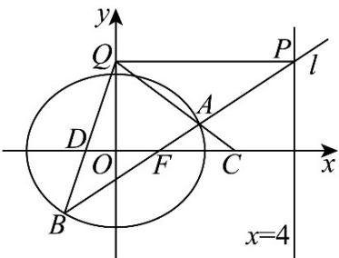

> [!faq]- 《专题10_椭圆标准方程及其性质全方位总结_九大题型__高效培优期中专项》官方解析
>
> > [!success]- **【答案】** (1) $\frac{x^{2}}{4}+\frac{y^{2}}{3}=1(2)(1,0)$
>
> > [!note]- **【分析】**
> > （1）根据椭圆的定义判断点 $M$ 的轨迹是椭圆，求出 $a, b$ ，即得椭圆方程；
> >
> > (2) 分别设直线的点斜式方程（方法一）和横截距式方程（方法二），将其与椭圆方程联立，设 $A(x_{1},y_{1}), B(x_{2},y_{2})$ ，写出韦达定理，依次求出点 $P, Q$ 的坐标，写出直线 $AQ$ 和 $BQ$ 的方程，求得点 $C, D$ 的坐标，化简计算线段 $CD$ 中点坐标即得.
>
> > [!note]- **【解析】**
> > （1）设 $F_{1}(-1,0), F_{2}(1,0)$ ，由题意，可得 $\left|MF_{1}\right| + \left|MF_{2}\right| = 4 > \left|F_{1}F_{2}\right|$ ，
> >
> > 由椭圆的定义可知点 $M$ 的轨迹是椭圆，
> >
> > 故可设曲线 $M$ 的方程为： $\frac{x^2}{a^2} +\frac{y^2}{b^2} = 1(a > b > 0)$
> >
> > 则 $c = 1$ ， $2a = 4$ ，故 $a = 2$ ， $b^{2} = 4 - 1 = 3$
> >
> > 曲线 M 的方程为： $\frac{x^{2}}{4}+\frac{y^{2}}{3}=1$ ；
> >
> > (2)
> >
> > 
> >
> > 方法一：直线 l 的斜率存在且不为 0，
> >
> > 设直线 $l$ 方程为 $y = k(x - 1)(k \neq 0)$
> >
> > 联立 $\left\{\begin{aligned}\frac{x^{2}}{4}+\frac{y^{2}}{3}&=1\\ y=k(x-1)\end{aligned}\right.$ ，整理得 $\left(3+4k^{2}\right)x^{2}-8k^{2}x+4k^{2}-12=0$
> >
> > 则 $\Delta = 64k^4 - 16(3 + 4k^2)(k^2 - 3) = 144k^2 + 144 > 0$
> >
> > 设 $A(x_{1},y_{1}),B(x_{2},y_{2})$ ，则 $x_{1} + x_{2} = \frac{8k^{2}}{3 + 4k^{2}}$ ， $x_{1}x_{2} = \frac{4k^{2} - 12}{3 + 4k^{2}}$
> >
> > 直线 l 交直线 x = 4 于点 $P(4, 3k)$ ，则 $Q(0, 3k)$ ，
> >
> > 则直线 $AQ$ 的方程为： $y = \frac{y_1 - 3k}{x_1} x + 3k$ ， $x_1 \neq 0$ ，
> >
> > 令 $y = 0$ ，解得 $x_{C} = \frac{3kx_{1}}{3k - y_{1}}$ ，则 $C(\frac{3kx_1}{3k - y_1},0)$
> >
> > 直线 $BQ$ 的方程为： $y = \frac{y_2 - 3k}{x_2} x + 3k$ ， $x_2 \neq 0$ ，
> >
> > 令 $y = 0$ ，解得 $x_{D} = \frac{3kx_{2}}{3k - y_{2}}$ ，则 $D(\frac{3kx_2}{3k - y_2},0)$
> >
> > $$
> > \therefore \frac {3 k x _ {1}}{3 k - y _ {1}} + \frac {3 k x _ {2}}{3 k - y _ {2}} = \frac {- 3 k [ x _ {1} (y _ {2} - 3 k) + x _ {2} (y _ {1} - 3 k) ]}{(y _ {1} - 3 k) (y _ {2} - 3 k)}
> > $$
> >
> > $$
> > = \frac {- 3 k [ x _ {1} k (x _ {2} - 4) + x _ {2} k (x _ {1} - 4) ]}{k ^ {2} (x _ {1} - 4) (x _ {2} - 4)} = \frac {1 2 (x _ {1} + x _ {2}) - 6 x _ {1} x _ {2}}{(x _ {1} - 4) (x _ {2} - 4)}
> > $$
> >
> > $$
> > = 6 \times \frac {2 \left(x _ {1} + x _ {2}\right) - x _ {1} x _ {2}}{x _ {1} x _ {2} - 4 \left(x _ {1} + x _ {2}\right) + 1 6} = 6 \times \frac {\frac {1 6 k ^ {2}}{3 + 4 k ^ {2}} - \frac {4 k ^ {2} - 1 2}{3 + 4 k ^ {2}}}{\frac {4 k ^ {2} - 1 2}{3 + 4 k ^ {2}} - \frac {3 2 k ^ {2}}{3 + 4 k ^ {2}} + 1 6}
> > $$
> >
> > $$
> > = 6 \times \frac {1 2 k ^ {2} + 1 2}{3 6 k ^ {2} + 3 6} = 2
> > $$
> >
> > 所以线段 CD 中点的坐标为 $(1,0)$ ;
> >
> > 方法二：直线 l 的斜率存在且不为 0，
> >
> > 设直线 $l$ 方程为 $my = x - 1(m \neq 0)$
> >
> > 联立 $\left\{ \begin{array}{l} \frac{x^2}{4} + \frac{y^2}{3} = 1 \\ my = x - 1 \end{array} \right.$ ，整理得 $\left(3m^2 + 4\right)y^2 + 6my - 9 = 0$
> >
> > $\Delta = 36m^{2} + 36(3m^{2} + 4) > 0$ ，设 $A(x_{1},y_{1}),B(x_{2},y_{2})$
> >
> > 则 $y_{1} + y_{2} = -\frac{6m}{4 + 3m^{2}}$ ， $y_{1}y_{2} = \frac{-9}{4 + 3m^{2}}$
> >
> > 直线 l 交直线 $_{x=4}$ 于 $P(4,\frac{3}{m})$ ，则 $Q(0,\frac{3}{m})$ ，
> >
> > 则直线 AQ 的方程为： $y=\frac{y_{1}-\frac{3}{m}}{x_{1}}x+\frac{3}{m}$ ， $x_{1}\neq0$ ，
> >
> > 令 $y = 0$ ，解得 $x_{C} = \frac{3x_{1}}{3 - my_{1}}$ ，则 $C(\frac{3x_1}{3 - my_1},0)$ ，同理可得 $D(\frac{3x_2}{3 - my_2},0)$
> >
> > $\therefore \frac{3x_1}{3 - my_1} + \frac{3x_2}{3 - my_2} = \frac{-3[x_1(my_2 - 3) + x_2(my_1 - 3)]}{(3 - my_1)(3 - my_2)}$ $= \frac{-3[(my_1 + 1)(my_2 - 3) + (my_2 + 1)(my_1 - 3)}{(3 - my_1)(3 - my_2)}$ $= \frac{-6(m^2y_1y_2 - m(y_1 + y_2) - 3)}{m^2y_1y_2 - 3m(y_1 + y_2) + 9} = -6 \cdot \frac{\frac{-9m^2}{4 + 3m^2} - \frac{-6m^2}{4 + 3m^2} - 3}{\frac{-9m^2}{4 + 3m^2} - \frac{-18m^2}{4 + 3m^2} + 9}$ $= 6 \times \frac{12m^2 + 12}{36m^2 + 36} = 2$
> >
> > 所以线段 CD 中点的坐标为 $(1,0)$ .
