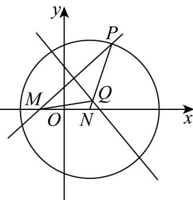

> [!faq]- 《专题10_椭圆标准方程及其性质全方位总结_九大题型__高效培优期中专项》官方解析
>
> > [!success]- **【答案】** B
>
> > [!note]- **【分析】**
> > 由一般方程得到圆心和半径，再由几何关系得到点 $Q$ 的轨迹是以 $M, N$ 为焦点的椭圆即可；
>
> > [!note]- **【解析】**
> > 
> >
> > 由题意得 $\left(x - 3\right)^2 + y^2 = 64$ ，圆心 $(3,0)$ ，半径 $r = 8$ ，
> >
> > 因为 $\left|QM\right| = \left|QP\right|$ ， $\left|QN\right| + \left|QM\right| = \left|QP\right| + \left|QN\right| = \left|NP\right| = 8 > \left|MN\right| = 6$
> >
> > 所以点 $Q$ 的轨迹是以 $M, N$ 为焦点的椭圆，其中 $2a = 8, 2c = 6, \therefore c = 3, a = 4, \therefore b^2 = 7$ 所以动点 $Q$ 的轨迹方程为 $\frac{x^2}{16} + \frac{y^2}{7} = 1$
> >
> > 故选 **B**.
