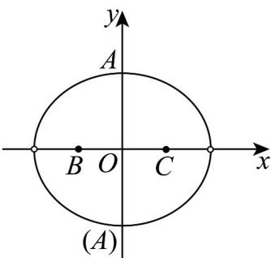
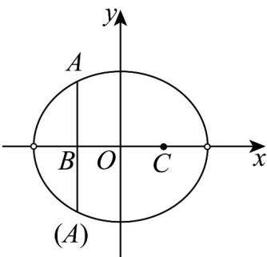

> [!faq]- 《专题10_椭圆标准方程及其性质全方位总结_九大题型__高效培优期中专项》官方解析
>
> > [!success]- **【答案】** D
>
> > [!note]- **【分析】**
> > 运用正弦定理及椭圆定义可得动点 A 的轨迹，运用数形结合即可求得结果
>
> > [!note]- **【解析】**
> > 由已知 $B(-3,0)$ ， $C(3,0)$ ，则 $|BC|=6$ ，
> >
> > 因为 $\sin B + \sin C = 2\sin A$ ，则由正弦定理可知 $\left|AC\right| + \left|AB\right| = 2\left|BC\right| = 12 > 6 = \left|BC\right|$ ，
> > 所以动点 A 的轨迹是以 B，C 为焦点，长轴长为 12 的椭圆，不含左、右顶点，所以当且仅当点 $A$ 是椭圆的上、下顶点时，点 $A$ 到直线 $BC$ 的距离最大为 $d_{2} = \sqrt{6^{2} - 3^{2}} = 3\sqrt{3}$
> >
> > 
> >
> > 
> >
> > 当 $AB \perp BC$ 时，点 $C$ 到直线 $AB$ 的距离最大为 $d_{1} = |BC| = 6$
> >
> > 所以 $\frac{d_1}{d_2} = \frac{6}{3\sqrt{3}} = \frac{2\sqrt{3}}{3}$
> >
> > 故选 **D**.
