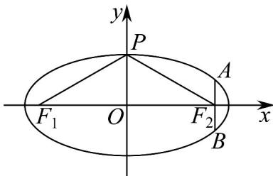

> [!faq]- 《专题10_椭圆标准方程及其性质全方位总结_九大题型__高效培优期中专项》官方解析
>
> > [!success]- **【答案】** ACD
>
> > [!note]- **【分析】**
> > 首先求出椭圆方程，当点 $P$ 为椭圆的上、下顶点时， $\angle F_{1}PF_{2}$ 最大，即可判断 ${}^{\mathrm{A}}$ ，根据 $\left|PF_{2}\right|$ 的范围判断 ${}^{\mathrm{B}}$ ，利用余弦定理及椭圆的定义求出焦点三角形的面积，即可判断 ${}^{\mathrm{C}}$ ，根据焦点弦的性质判断 ${}^{\mathrm{D}}$ .
>
> > [!note]- **【解析】**
> > 因为 $e=\frac{c}{a}=\frac{\sqrt{3}}{2}$ ， $\left|AF_{1}\right|$ 的最小值为 $2-\sqrt{3}$ ，即 $a-c=2-\sqrt{3}$ ，所以 $\left\{\begin{aligned}a=2\\ c=\sqrt{3}\end{aligned}\right.$
> >
> > 则 $b=\sqrt{a^{2}-c^{2}}=1$ ，所以椭圆 M 的方程为 $\frac{x^{2}}{4}+y^{2}=1$ ；
> >
> > 对于 A，当点 P 为椭圆的上、下顶点时， $\angle F_{1}PF_{2}$ 最大，如下图：
> >
> > 
> >
> > 由椭圆 $M: \frac{x^{2}}{4} + y^{2} = 1$ ，则 $\left|PO\right| = 1$ ， $\left|PF_{2}\right| = 2$ ，在 $Rt\triangle OPF_{2}$ 中， $\angle OPF_{2} = 60^{\circ}$ ，
> >
> > 易知此时 $\angle F_{1}PF_{2} = 120^{\circ}$ ，所以 $\angle F_{1}PF_{2}$ 的取值范围为 $\left[0,\frac{2\pi}{3}\right]$ ，故A正确；
> >
> > 对于 B，当点 P 在椭圆的上，下顶点时，满足 $\Delta F_{1}PF_{2}$ 为等腰三角形，
> >
> > 又因为 $2 - \sqrt{3} \leq \left|PF_{2}\right| \leq 2 + \sqrt{3}$ ， $\left|F_1F_2\right| = 2\sqrt{3}$
> >
> > 所以满足 $\left|PF_2\right| = \left|F_1F_2\right|$ 的点 $P$ 有2个，同理，满足 $\left|PF_1\right| = \left|F_1F_2\right|$ 的点 $P$ 有2个，
> >
> > 综上可得，满足 $\triangle F_{1}PF_{2}$ 为等腰三角形的点 $P$ 有6个，故B错误；
> >
> > 对于 $C$ ，设 $\left|PF_1\right| = m$ ， $\left|PF_2\right| = n$ ，则 $m + n = 2a = 4$ ， $\left|F_1F_2\right| = 2c = 2\sqrt{3}$
> >
> > 在 $\triangle F_{1}PF_{2}$ 中，根据余弦定理得 $\cos \angle F_{1}PF_{2} = \frac{\left|PF_{1}\right|^{2} + \left|PF_{2}\right|^{2} - \left|F_{1}F_{2}\right|^{2}}{2\left|PF_{1}\right|\cdot\left|PF_{2}\right|}$
> >
> > 所以 $\cos 60^{\circ} = \frac{m^{2} + n^{2} - 12}{2mn} = \frac{(m + n)^{2} - 12 - 2mn}{2mn} = \frac{1}{2}$ ，整理可得 $mn = \frac{4}{3}$
> >
> > 则 $S_{\triangle F_1PF_2} = \frac{1}{2}\left|PF_1\right|\cdot \left|PF_2\right|\cdot \sin \angle F_1PF_2 = \frac{1}{2} mn\sin 60^\circ = \frac{\sqrt{3}}{3}$ ，故C正确；
> >
> > 对于 $\mathrm{D}$ ：因为过点 $F_{2}$ 的直线与该椭圆相交于 $A$ ， $B$ 两点，
> >
> > 当过点 $F_{2}$ 且垂直于 x 轴的直线与该椭圆相交于 A，B 两点时 $\left|AB\right|$ 取得最小值，
> >
> > 由 $\left\{ \begin{array}{l}x = \sqrt{3}\\ \frac{x^2}{4} +y^2 = 1 \end{array} \right.$ ，解得 $y = \pm \frac{1}{2}$ ，所以 $\left|AB\right|_{\min} = 1$ ，又 $\left|AB\right|_{\max} = 2a = 4$
> >
> > 所以 $1 \leq |AB| \leq 4$ ，故 D 正确；
> >
> > 故选 **ACD**
