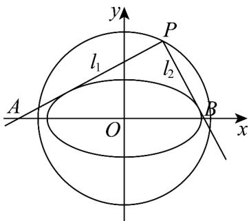

> [!faq]- 《专题10_椭圆标准方程及其性质全方位总结_九大题型__高效培优期中专项》官方解析
>
> > [!success]- **【答案】** (1) $\frac{x^{2}}{4}+y^{2}=1,x^{2}+y^{2}=5$ (2) (i) 证明见详解；(ii) $\left[2\sqrt{5}, +\infty\right)$
>
> > [!note]- **【分析】**
> > （1）根据圆和椭圆的性质可得 $\left|MN\right|\leq\sqrt{a^{2}+b^{2}}+a$ ，结合题意列式求解即可；
> >
> > (2) (i) 设直线方程为 $y = kx + m$ ，联立方程结合圆的方程 $k_{1}, k_{2}$ 是方程 $\left(x_{0}^{2} - 4\right)k^{2} - 2x_{0}y_{0}k + y_{0}^{2} - 1 = 0$ 的根，利用韦达定理分析证明；(ii) 求点 $A, B$ ，结合韦达定理可得 $|AB| = 2\sqrt{\frac{y_0^2(3y_0^2 + 1)}{(y_0^2 - 1)^2}}$ ，换元结合二次函数求取
> >
> > 值范围·
>
> > [!note]- **【解析】**
> > （1）圆 $C_2$ 的圆心为 $O$ ，半径 $r = \sqrt{a^2 + b^2}$
> >
> > 则 $\left|MN\right|\leq r+\left|OM\right|\leq\sqrt{a^{2}+b^{2}}+a$
> >
> > 由题意可得： $\left\{ \begin{array}{l} \sqrt{a^2 + b^2} + a = \sqrt{5} + 2 \\ e = \frac{c}{a} = \frac{\sqrt{3}}{2} \\ c^2 = a^2 - b^2 \end{array} \right.$ ，解得 $\left\{ \begin{array}{l} a = 2 \\ b = 1 \\ c = \sqrt{3} \end{array} \right.$ ，
> >
> > 所以椭圆 $C_1$ 和圆 $C_2$ 的方程分别是 $\frac{x^2}{4} + y^2 = 1, x^2 + y^2 = 5$ .
> >
> > (2) (i) 设直线方程为 $y = kx + m$
> >
> > 联立方程 $\left\{ \begin{array}{l} y = kx + m \\ \frac{x^2}{4} + y^2 = 1 \end{array} \right.$ ，消去 $y$ 可得 $\left(4k^2 + 1\right)x^2 + 8kmx + 4m^2 - 4 = 0$
> >
> > 则 $\Delta = 64k^2 m^2 - 4(4k^2 + 1)(4m^2 - 4) = 0$ ，整理可得 $m^2 = 4k^2 + 1$
> >
> > 
> >
> > 又因为直线 $y = kx + m$ 过点 $P(x_{0}, y_{0})(y_{0} > 1)$
> >
> > 可得 $y_{0} = kx_{0} + m$ ，即 $m = y_0 - kx_0$
> >
> > 则 $\left(y_0 - kx_0\right)^2 = 4k^2 +1$ ，整理可得 $\left(x_0^2 -4\right)k^2 -2x_0y_0k + y_0^2 -1 = 0$
> >
> > 可知 $k_{1}, k_{2}$ 是方程 $\left(x_{0}^{2} - 4\right) k^{2} - 2x_{0}y_{0}k + y_{0}^{2} - 1 = 0$ 的根，
> >
> > 则 $k_{1} + k_{2} = \frac{2x_{0}y_{0}}{x_{0}^{2} - 4}$ ， $k_{1}k_{2} = \frac{y_{0}^{2} - 1}{x_{0}^{2} - 4}$
> >
> > 且 $P(x_{0},y_{0})$ 在圆 $C_{2}$ : $x^{2}+y^{2}=5$ 上，则 $x_{0}^{2}+y_{0}^{2}=5$ ，即 $y_{0}^{2}=5-x_{0}^{2}$ ，
> > 所以 $k_{1}k_{2}=\frac{5-x_{0}^{2}-1}{x_{0}^{2}-4}=-1$ ;
> >
> > (ii) 由 (1) 可得： $\left|k_{1}-k_{2}\right|=\sqrt{\left(k_{1}+k_{2}\right)^{2}-4k_{1}k_{2}}=\sqrt{\left(\frac{2x_{0}y_{0}}{x_{0}^{2}-4}\right)^{2}-\frac{4\left(y_{0}^{2}-1\right)}{x_{0}^{2}-4}}=\frac{2\sqrt{x_{0}^{2}+4y_{0}^{2}-4}}{\left|x_{0}^{2}-4\right|}=2\sqrt{\frac{3y_{0}^{2}+1}{\left(y_{0}^{2}-1\right)^{2}}}$
> >
> > 由直线 $l_{1}:y = k_{1}x + y_{0} - k_{1}x_{0},l_{2}:y = k_{2}x + y_{0} - k_{2}x_{0}$ 可得 $A\left(x_0 - \frac{y_0}{k_1},0\right),B\left(x_0 - \frac{y_0}{k_2},0\right)$
> >
> > $$
> > \left| A B \right| = \left| \left(x _ {0} - \frac {y _ {0}}{k _ {1}}\right) - \left(x _ {0} - \frac {y _ {0}}{k _ {2}}\right) \right| = y _ {0} \frac {\left| k _ {1} - k _ {2} \right|}{\left| k _ {1} k _ {2} \right|} = 2 y _ {0} \sqrt {\frac {3 y _ {0} ^ {2} + 1}{\left(y _ {0} ^ {2} - 1\right) ^ {2}}} = 2 \sqrt {\frac {y _ {0} ^ {2} \left(3 y _ {0} ^ {2} + 1\right)}{\left(y _ {0} ^ {2} - 1\right) ^ {2}}}
> > $$
> >
> > 因为 $y_0 \in (1, \sqrt{5}]$ ，令 $t = \frac{1}{y_0^2 - 1} \in \left[\frac{1}{4}, \infty\right)$ ，则 $y_0^2 = \frac{t + 1}{t}$
> >
> > 可得 $\left|AB\right|=2\sqrt{t^{2}\frac{t+1}{t}\left(3\frac{t+1}{t}+1\right)}=2\sqrt{4t^{2}+7t+3}\quad2\sqrt{5}$ ，
> >
> > $$
> > \left| A B \right|
> > $$
> >
> > $$
> > \left[ 2 \sqrt {5}, + \infty\right)
> > $$
