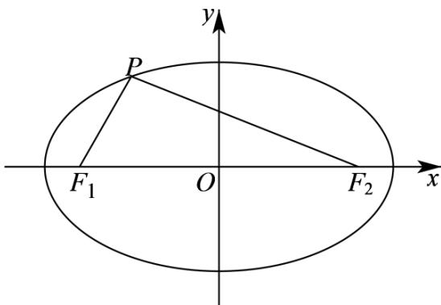

> [!faq]- 《专题10_椭圆标准方程及其性质全方位总结_九大题型__高效培优期中专项》官方解析
>
> > [!success]- **【答案】** AC
>
> > [!note]- **【分析】**
> > 利用余弦定理、椭圆定义结合三角形面积公式推导出 $S = b^{2} \tan \frac{\theta}{2}$ ，可判断 A 选项；设 $P(x_{1}, y_{1})$ ，可得出 $S = 4|y_{1}|$ ，结合 $S = 12$ ，求出 $|y_{1}|$ 的值，判断点 P 的位置，可判断 B 选项；利用椭圆的参数方程结合辅助角公式可判断 C 选项；对 $\triangle PF_{1}F_{2}$ 各内角为钝角进行分类讨论，求出 $|y_{1}|$ 的范围，可求得 S 的范围，可判断 D 选项。
>
> > [!note]- **【解析】**
> > 对于 A 选项，在椭圆 C 中，a=5，b=3，则 $c=\sqrt{a^{2}-b^{2}}=\sqrt{5^{2}-3^{2}}=4$ ，
> >
> > 由椭圆的定义可得 $\left|PF_{1}\right|+\left|PF_{2}\right|=2a=10$ ， $\left|F_{1}F_{2}\right|=2c=8$ ，且 $F_{1}(-4,0)$ 、 $F_{2}(4,0)$ ，
> >
> > 设 $\left|PF_{1}\right|=m,\left|PF_{2}\right|=n$ ，且 $m+n=2a$ ， $\angle F_{1}PF_{2}=\theta\in(0,\pi)$ ，
> >
> > 在 $\Delta F_{1}PF_{2}$ 中，由余弦定理可得 $4c^{2} = m^{2} + n^{2} - 2mn\cos \theta = (m + n)^{2} - 2mn(1 + \cos \theta) = 4a^{2} - 2mn(1 + \cos \theta)$
> >
> > 所以， $mn=\frac{2a^{2}-2c^{2}}{1+\cos\theta}=\frac{2b^{2}}{1+\cos\theta}$ ，
> >
> > 所以， $S=\frac{1}{2}mn\sin\theta=\frac{b^{2}\sin\theta}{1+\cos\theta}=\frac{2b^{2}\sin\frac{\theta}{2}\cos\frac{\theta}{2}}{2\cos^{2}\frac{\theta}{2}}=b^{2}\tan\frac{\theta}{2}=9\tan\frac{\theta}{2}=3\sqrt{3}$
> >
> > 所以， $\tan\frac{\theta}{2}=\frac{\sqrt{3}}{3}$ ，
> >
> > 因为 $0 < \theta < \pi$ ，则 $0 < \frac{\theta}{2} < \frac{\pi}{2}$ ，所以， $\frac{\theta}{2} = \frac{\pi}{6}$ ，解得 $\theta = \frac{\pi}{3}$ ，A对；
> >
> > 对于 B 选项，设 $P(x_{1}, y_{1})$ ，则 $S = \frac{1}{2} \cdot |F_{1} F_{2}| \cdot |y_{1}| = 4 |y_{1}| = 12$ ，且 $0 < |y_{1}| \leq 3$ ，解得 $y_{1} = \pm 3$ ，
> >
> > 此时点 P 为椭圆短轴的顶点，故满足条件的点 P 只有两个， $^{B}$ 错；
> >
> > 对于 $C$ 选项，设椭圆 $C$ 内接矩形的一个顶点为 $\left(5\cos \alpha,3\sin \alpha\right)\left(0 <   \alpha <  \frac{\pi}{2}\right)$
> >
> > 则椭圆 C 内接矩形周长为 $4(5\cos\alpha+3\sin\alpha)=4\sqrt{34}\sin(\alpha+\varphi)$
> >
> > 其中 $\varphi$ 为锐角，且 $\tan\varphi=\frac{5}{3}$
> >
> > 由 $0 < \alpha < \frac{\pi}{2}$ 得 $\alpha + \varphi \in \left(\varphi, \frac{\pi}{2} + \varphi\right)$ ，
> >
> > 当 $\alpha +\varphi = \frac{\pi}{2}$ 时， $\sin (\alpha +\varphi) = 1$ ，此时椭圆 $C$ 的内接矩形周长取最大值为 $4\sqrt{34}$ ，故正确；
> >
> > 对于 D 选项，若 $\angle F_{1}PF_{2}$ 为钝角， $PF_{1} = (-4 - x_{1}, -y_{1})$ ， $PF_{2} = (4 - x_{1}, -y_{1})$ ，
> >
> > 则 $PF_{1} \cdot PF_{2} = (-x_{1} - 4)(-x_{1} + 4) + (-y_{1})^{2} = x_{1}^{2} + y_{1}^{2} - 16 = 25 - \frac{25y_{1}^{2}}{9} + y_{1}^{2} - 16$
> >
> > $= 9 - \frac{16y_1^2}{9} < 0$ ，解得 $\left|y_1\right| > \frac{9}{4}$ ，所以， $\frac{9}{4} < \left|y_1\right| \leq 3$
> >
> > 此时， $S=\frac{1}{2}\cdot\left|F_{1}F_{2}\right|\cdot\left|y_{1}\right|=4\left|y_{1}\right|\in(9,12]$ ；
> >
> > 若 $\angle PF_{1}F_{2}$ 为钝角，且 $F_{1}F_{2} = (8,0)$ ， $F_{1}P = (x_{1} + 4,y_{1})$ ，则 $F_{1}P \cdot F_{1}F_{2} = 8(x_{1} + 4) < 0$ ，可得 $x_{1} < -4$ ，又因为 $-5 < x_{1} < 5$ ，所以， $-5 < x_{1} < -4$ ，则 $y_{1}^{2} = 9 - \frac{9x_{1}^{2}}{25} \in \left(0, \frac{81}{25}\right)$ ，可得 $0 < |y_{1}| < \frac{9}{5}$ ，此时， $S = 4|y_{1}| \in \left(0, \frac{36}{5}\right)$ ；当 $\angle PF_{2}F_{1}$ 为钝角时，同理可知 $S = 4|y_{1}| \in \left(0, \frac{36}{5}\right)$ 。因此， $s$ 的取值范围是 $\left(0, \frac{36}{5}\right) \cup (9,12]$ ，D 错。
> >
> > 
> >
> > 故选 **AC**.
