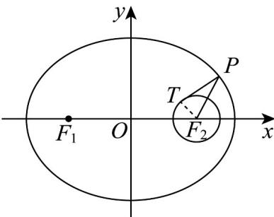

> [!faq]- 《专题10_椭圆标准方程及其性质全方位总结_九大题型__高效培优期中专项》官方解析
>
> > [!success]- **【答案】** $\left[\frac{3}{5},\frac{\sqrt{2}}{2}\right)$
>
> > [!note]- **【分析】**
> > 由题意作图，根据圆的切线性质以及勾股定理，可建立方程，根据焦半径的取值范围以及题干中的不等式，通过化简整理，代入离心率，可得答案：
>
> > [!note]- **【解析】**
> > 如下图所示：易知 $\left|PT\right|=\sqrt{\left|PF_{2}\right|^{2}-\left|TF_{2}\right|^{2}}=\sqrt{\left|PF_{2}\right|^{2}-(b-c)^{2}}$ ，
> >
> > 又焦半径 $\left|PF_{2}\right|$ 的最小值为a-c，且 $\left|PT\right|\frac{\sqrt{3}}{2}(a-c)$ 恒成立，
> >
> > 则 $(a - c)^2 -(b - c)^2$ $\frac{3}{4} (a - c)^2$ ，又 $b - c > 0,a - c > 0$ ，所以 $\frac{1}{2}\big(a - c\big)$ $b - c$
> >
> > 整理可得 $a + c = 2b$ ，即 $(a + c)^{2} = 4b^{2} = 4a^{2} - 4c^{2}$ ，可得 $5c^2 + 2ac - 3a^2 \geq 0$ ，即 $5e^{2} + 2e - 3 = 0$
> >
> > 又 $e \in (0,1)$ ，解得 $e = \frac{3}{5}$ ，又半径 $b - c > 0$ ，则 $a^2 - c^2 > c^2$ ，解得 $e < \frac{\sqrt{2}}{2}$
> >
> > 所以 $e \in \left[\frac{3}{5}, \frac{\sqrt{2}}{2}\right)$ .
> >
> > 
> >
> > 故答案为： $\left[\frac{3}{5},\frac{\sqrt{2}}{2}\right)$
