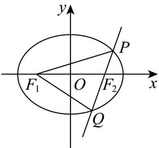
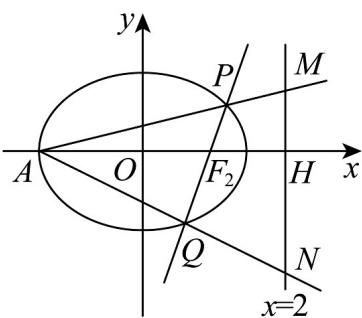

> [!faq]- 《专题10_椭圆标准方程及其性质全方位总结_九大题型__高效培优期中专项》官方解析
>
> > [!success]- **【答案】** (1)3 (2)2 (3) $\{1\}$
>
> > [!note]- **【分析】**
> > （1）根据离心率得到方程，求出 $a = 3$ ；
> >
> > (2) 设直线 $l$ 的方程为 $x = my + \sqrt{3}$ , $P(x_1, y_1)$ , $Q(x_2, y_2)$ , 联立直线和椭圆方程, 得到两根之和, 两根之积, 利用 $S = \frac{1}{2} |F_1 F_2||y_1 - y_2|$ 表达出三角形面积, 由基本不等式求出最大值;
> >
> > （3）设出直线方程，联立直线和椭圆方程，得到两根之和，两根之积，进而得到直线 $AP$ 的方程，求出 $\left|HM\right| = \frac{\left|\left(2 + \sqrt{2}\right)y_1\right|}{x_1 + \sqrt{2}}$ ，同理 $\left|HN\right| = \frac{\left|\left(2 + \sqrt{2}\right)y_2\right|}{x_2 + \sqrt{2}}$ ，计算出 $|MH|\cdot |NH| = 1$ ，求出取值范围·
>
> > [!note]- **【解析】**
> > （1）椭圆 $\Gamma$ 的离心率为 $\frac{2\sqrt{2}}{3}$ ，故 $e^{2}=\frac{c^{2}}{a^{2}}=\frac{a^{2}-1}{a^{2}}=\left(\frac{2\sqrt{2}}{3}\right)^{2}$
> >
> > 解得 a = 3 ;
> >
> > (2) a=2 时， $c^{2}=a^{2}-1=3$ ，故 $c=\sqrt{3}$ ，所以 $F_{1}\left(-\sqrt{3},0\right)$ ， $F_{2}\left(\sqrt{3},0\right)$
> >
> > P、Q 均不在 x 轴上，故直线 l 的斜率不为 0
> >
> > 设直线 l 的方程为 $x = my + \sqrt{3}$ ， $P(x_{1}, y_{1})$ ， $Q(x_{2}, y_{2})$ ，
> >
> > 联立 $x = my + \sqrt{3}$ 与 $\frac{x^{2}}{4} + y^{2} = 1$ 得 $(m^{2} + 4)y^{2} + 2\sqrt{3}my - 1 = 0$
> >
> > 所以 $y_{1}$ ， $y_{2}$ 是方程 $(m^{2}+4)y^{2}+2\sqrt{3}my-1=0$ 的两根，
> >
> > $\Delta = 12m^{2} + 4(m^{2} + 4) = 16m^{2} + 16 > 0$
> >
> > $$
> > y _ {1} + y _ {2} = \frac {- 2 \sqrt {3} m}{m ^ {2} + 4}, y _ {1} y _ {2} = \frac {- 1}{m ^ {2} + 4},
> > $$
> >
> > 所以 $\left|y_{1} - y_{2}\right| = \sqrt{\left(y_{1} + y_{2}\right)^{2} - 4y_{1}y_{2}} = \sqrt{\left(\frac{-2\sqrt{3}m}{m^{2} + 4}\right)^{2} + \frac{4}{m^{2} + 4}} = \frac{4\sqrt{m^{2} + 1}}{m^{2} + 4}$
> >
> > 又 $\left|F_{1}F_{2}\right| = 2\sqrt{3}$ ，故 $\triangle F_1PQ$ 的面积 $S = \frac{1}{2}\left|F_1F_2\right|\left|y_1 - y_2\right| = 4\sqrt{3}\cdot \frac{\sqrt{m^2 + 1}}{m^2 + 4}$
> >
> > 
> >
> > 而 $4\sqrt{3}\cdot \frac{\sqrt{m^2 + 1}}{m^2 + 4} = \frac{4\sqrt{3}}{\sqrt{m^2 + 1} + \frac{3}{\sqrt{m^2 + 1}}} \leq \frac{4\sqrt{3}}{2\sqrt{\sqrt{m^2 + 1}\cdot\frac{3}{\sqrt{m^2 + 1}}}} = 2$
> >
> > 当且仅当 $\sqrt{m^2 + 1} = \frac{3}{\sqrt{m^2 + 1}}$ ，即 $m^2 = 2$ 时等号成立，
> >
> > 所以 $\triangle F_{A}PQ$ 的面积的最大值为 2；
> >
> > (3) $a = \sqrt{2}$ 时， $c = 1$ ，所以 $F_{1}(-1,0)$ ， $F_{2}(1,0)$ ，
> >
> > 椭圆方程为 $\frac{x^2}{2} + y^2 = 1$
> >
> > 设直线 l 的方程为 $x = my + 1$ ， $P(x_{1}, y_{1})$ ， $Q(x_{2}, y_{2})$
> >
> > 联立 $x = my + 1$ 与 $\frac{x^2}{2} + y^2 = 1$ 可得 $\left(m^2 + 2\right)y^2 + 2my - 1 = 0$
> >
> > 
> >
> > 所以 $y_{1}$ ， $y_{2}$ 是方程 $(m^{2}+2)y^{2}+2my-1=0$ 的两根，
> >
> > $y_{1} + y_{2} = \frac{-2m}{m^{2} + 2}$ ， $y_{1}y_{2} = \frac{-1}{m^{2} + 2}$
> >
> > 故 $x_{1} + x_{2} = m(y_{1} + y_{2}) + 2 = \frac{-2m^{2}}{m^{2} + 2} +2 = \frac{4}{m^{2} + 4}$
> >
> > $$
> > x _ {1} x _ {2} = \left(m y _ {1} + 1\right) \left(m y _ {2} + 1\right) = m ^ {2} y _ {1} y _ {2} + m \left(y _ {1} + y _ {2}\right) + 1 = \frac {- m ^ {2}}{m ^ {2} + 2} - \frac {2 m ^ {2}}{m ^ {2} + 2} + 1 = \frac {- 2 m ^ {2} + 2}{m ^ {2} + 2},
> > $$
> >
> > 又 $A\left(-\sqrt{2},0\right)$ ，故直线 $AP$ 的方程为 $y = \frac{y_1}{x_1 + \sqrt{2}}\left(x + \sqrt{2}\right)$
> >
> > 令得 $y = \frac{(2 + \sqrt{2})y_1}{x_1 + \sqrt{2}}$ ，故 $M\left(2,\frac{(2 + \sqrt{2})y_1}{x_1 + \sqrt{2}}\right)$
> >
> > 所以 $\left|HM\right|=\frac{\left|\left(2+\sqrt{2}\right)y_{1}\right|}{x_{1}+\sqrt{2}}$ ，同理可得 $\left|HN\right|=\frac{\left|\left(2+\sqrt{2}\right)y_{2}\right|}{x_{2}+\sqrt{2}}$
> >
> > $$
> > \left| M H \right| \cdot \left| N H \right| = \frac {\left| (2 + \sqrt {2}) y _ {1} \right|}{x _ {1} + \sqrt {2}} \cdot \frac {\left| (2 + \sqrt {2}) y _ {2} \right|}{x _ {2} + \sqrt {2}} = \frac {(2 + \sqrt {2}) ^ {2} \cdot \left| \frac {- 1}{m ^ {2} + 2} \right|}{x _ {1} x _ {2} + \sqrt {2} (x _ {1} + x _ {2}) + 2}
> > $$
> >
> > $$
> > = \frac {(6 + 4 \sqrt {2}) \cdot \frac {1}{m ^ {2} + 2}}{\frac {- 2 m ^ {2} + 2}{m ^ {2} + 2} + \frac {4 \sqrt {2}}{m ^ {2} + 2} + 2} = \frac {(6 + 4 \sqrt {2}) \cdot \frac {1}{m ^ {2} + 2}}{\frac {6 + 4 \sqrt {2}}{m ^ {2} + 2}} = 1
> > $$
> >
> > 所以 $\left| MH \right| \cdot \left| NH \right|$ 的取值范围为 $\{1\}$ .
