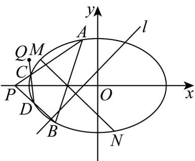

> [!faq]- 《专题10_椭圆标准方程及其性质全方位总结_九大题型__高效培优期中专项》官方解析
>
> > [!success]- **【答案】** (1) $\frac{x^{2}}{3}+y^{2}=1$ (2) $t=\frac{1}{2}$ (3) $k = 2$
>
> > [!note]- **【分析】**
> > （1）由已知条件列方程组求得 $a, b, c$ 得标准方程；
> >
> > (2) 设 $M\left(-\frac{3}{2}, \frac{1}{2}\right)$ ，由对称求得点 $N(s, n)$ 坐标，代入椭圆方程可得 $2t^{2} - 5t + 2 = 0$ ，计算即可；
> >
> > (3) 设 $A(x_{1}, y_{1}), B(x_{2}, y_{2}), C(x_{3}, y_{3}), D(x_{4}, y_{4})$ ，直线的斜率为 $k_{1} = k_{PA} = \frac{y_{1}}{x_{1} + 2}$ ，直线 $PA$ 的方程为 $y = k_{1}(x + 2)$ ，代入椭圆方程求得点 $C$ 坐标，同理求得点 $D$ 坐标，由三点共线得向量共线，由向量共线的坐标表示可得结论。
>
> > [!note]- **【解析】**
> > （1）椭圆 $\Gamma : \frac{x^2}{a^2} + \frac{y^2}{b^2} = 1 (a > b > 0)$ 的长轴长为 $2\sqrt{3}$ ，离心率为 $\frac{\sqrt{6}}{3}$
> >
> > 则 $a = \sqrt{3},\frac{c}{a} = \frac{\sqrt{6}}{3}$ ，则 $c = \sqrt{2}$ ，则 $b = \sqrt{a^2 - c^2} = \sqrt{3 - 2} = 1$
> >
> > 则椭圆 $\Gamma$ 的方程为 $\frac{x^2}{3} + y^2 = 1$ .
> >
> > (2) 设椭圆上点 $M\left(-\frac{3}{2}, \frac{1}{2}\right)$ 关于直线 l 的对称点 $N(s, n)$ ,
> >
> > 则 $\left\{ \begin{array}{l} n + \frac{1}{2} = \frac{s - \frac{3}{2}}{2} + t \\ n - \frac{1}{2} = -1 \\ s + \frac{3}{2} = 0 \end{array} \right.$
> >
> > 解之得 $\left\{ \begin{array}{l} s = \frac{1}{2} - t \\ n = -\frac{3}{2} + t \end{array} \right.$ ，则 $N\left(\frac{1}{2} - t, -\frac{3}{2} + t\right)$ ，
> >
> > 由 在椭圆 上，可得 $\frac{\left(\frac{1}{2} - t\right)^2}{3} + \left(-\frac{3}{2} + t\right)^2 = 1$
> >
> > 整理得 $2t^{2}-5t+2=0$ ，解之得 $t=\frac{1}{2}$ 或 t=2，
> >
> > 当 $t = 2$ 时 $N\left(-\frac{3}{2},\frac{1}{2}\right)$ 与点 $M$ 重合，舍去，
> >
> > 则 $t = \frac{1}{2}$
> >
> > (3) 设 $A(x_{1},y_{1}), B(x_{2},y_{2}), C(x_{3},y_{3}), D(x_{4},y_{4})$ ，则 $x_{1}^{2} + 3y_{1}^{2} = 3, x_{2}^{2} + 3y_{2}^{2} = 3$
> >
> > 又 $P(-2,0)$ ，则 $k_{1} = k_{PA} = \frac{y_{1}}{x_{1} + 2}$ ，直线 $PA$ 的方程为 $y = k_{1}(x + 2)$
> >
> > 由 $\left\{\begin{aligned}y&=k_{1}(x+2)\\ \frac{x^{2}}{3}&+y^{2}=1\end{aligned}\right.$ ，整理得 $\left(1+3k_{1}^{2}\right)x^{2}+12k_{1}^{2}x+12k_{1}^{2}-3=0$
> >
> > 则 $x_{1} + x_{3} = -\frac{12k_{1}^{2}}{1 + 3k_{1}^{2}}$ ，则 $x_{3} = -\frac{12k_{1}^{2}}{1 + 3k_{1}^{2}} -x_{1}$
> >
> > 又 $k_{1} = \frac{y_{1}}{x_{1} + 2}$ ，则 $x_{3} = -\frac{12\left(\frac{y_{1}}{x_{1} + 2}\right)^{2}}{1 + 3\left(\frac{y_{1}}{x_{1} + 2}\right)^{2}} -x_{1} = \frac{-7x_{1} - 12}{4x_{1} + 7}$
> >
> > 则 $y_{3} = \frac{y_{1}}{4x_{1} + 7}$ ，则 $C\left(\frac{-7x_1 - 12}{4x_1 + 7},\frac{y_1}{4x_1 + 7}\right)$
> >
> > 令则 $k_{2} = k_{PB} = \frac{y_{2}}{x_{2} + 2}$ ，直线 $P B$ 的方程为 $y = k_{2}(x + 2)$
> >
> > 由 $\left\{\begin{aligned}y&=k_{2}(x+2)\\ \frac{x^{2}}{3}&+y^{2}=1\end{aligned}\right.$ ，整理得 $\left(1+3k_{2}^{2}\right)x^{2}+12k_{2}^{2}x+12k_{2}^{2}-3=0$
> >
> > 则 $x_{2} + x_{4} = -\frac{12k_{2}^{2}}{1 + 3k_{2}^{2}}$ ，则 $x_{4} = -\frac{12k_{2}^{2}}{1 + 3k_{2}^{2}} -x_{2}$
> >
> > 又 $k_{2} = \frac{y_{2}}{x_{2} + 2}$ ，则 $x_{4} = -\frac{12\left(\frac{y_{2}}{x_{2} + 2}\right)^{2}}{1 + 3\left(\frac{y_{2}}{x_{2} + 2}\right)^{2}} -x_{2} = \frac{-7x_{2} - 12}{4x_{2} + 7}$
> >
> > 则 $y_{4} = \frac{y_{2}}{4x_{2} + 7}$ ，则 $D\left(\frac{-7x_2 - 12}{4x_2 + 7},\frac{y_2}{4x_2 + 7}\right)$
> >
> > $$
> > \overrightarrow {Q C} = \left(\frac {- 7 x _ {1} - 1 2}{4 x _ {1} + 7} + \frac {7}{4}, \frac {y _ {1}}{4 x _ {1} + 7} - \frac {1}{2}\right) = \left(\frac {1}{4 (4 x _ {1} + 7)}, \frac {y _ {1}}{4 x _ {1} + 7} - \frac {1}{2}\right)
> > $$
> >
> > $QD = \left(\frac{-7x_{2} - 12}{4x_{2} + 7} +\frac{7}{4},\frac{y_{2}}{4x_{2} + 7} -\frac{1}{2}\right) = \left(\frac{1}{4(4x_{2} + 7)},\frac{y_{2}}{4x_{2} + 7} -\frac{1}{2}\right)$
> >
> > 由点 $C, D$ 和点 $Q\left(-\frac{7}{4}, \frac{1}{2}\right)$ 三点共线，可得 $\overline{QC} // \overline{QD}$ ，
> >
> > 则 $\frac{1}{4(4x_1 + 7)}\left(\frac{y_2}{4x_2 + 7} -\frac{1}{2}\right) - \frac{1}{4(4x_2 + 7)}\left(\frac{y_1}{4x_1 + 7} -\frac{1}{2}\right) = 0$
> >
> > 整理得 $y_{2} - y_{1} = 2(x_{2} - x_{1})$ ，则 $k = \frac{y_2 - y_1}{x_2 - x_1} = 2.$
> >
> > 
>
> > [!tip]- **【名师点睛】**
> > 方法点睛：解决直线与椭圆的综合问题时，要注意：
> >
> > (1) 注意观察应用题设中的每一个条件，明确确定直线、椭圆的条件；
