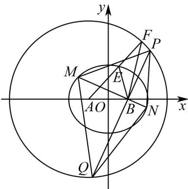

> [!faq]- 《专题10_椭圆标准方程及其性质全方位总结_九大题型__高效培优期中专项》官方解析
>
> > [!success]- **【答案】** (1) $\frac{x^{2}}{4}+\frac{y^{2}}{3}=1$ (2) $\left[12,8\sqrt{3}\right]$
>
> > [!note]- **【分析】**
> > （1）根据题意可知 $|EA| + |EB| = |EA| + |EF| = |AF| = 4$ ，结合椭圆的定义可得点 $E$ 的轨迹方程；（2）当直线 $l$ 斜率不存在时，可求得四边形MPNQ的面积为12；当直线 $l$ 斜率存在时，设其方程为 $y = k(x - 1)$ ，利用弦长公式求出 $|MN|$ 与 $|PQ|$ ，进而求出四边形MPNQ面积关系式，利用函数的有界性即
> >
> > 可求出面积的取值范围·
>
> > [!note]- **【解析】**
> > （1）圆 $A$ 的标准方程为 $\left(x + 1\right)^2 +y^2 = 16$ ，得 $A(-1,0)$ ，半径 $\left|AF\right| = 4$
> >
> > 由线段 BF 的垂直平分线与 AF 交于 E 点，可得 $\left|EF\right|=\left|EB\right|$ .
> >
> > 因为 $\left|EA\right|+\left|EB\right|=\left|EA\right|+\left|EF\right|=\left|AF\right|=4$ ，且 $\left|AB\right|=2<4$
> >
> > 由椭圆的定义可知点 E 的轨迹是以 $A(-1,0)$ ， $B(1,0)$ 为两焦点的椭圆，
> >
> > 又 $2a = 4, c = 1, b^2 = a^2 - c^2 = 3$
> >
> > 则点 E 的轨迹方程为： $\frac{x^{2}}{4}+\frac{y^{2}}{3}=1$ .
> >
> > (2) 当直线 l 斜率不存在时，即 l 方程为 x = 1 ， $\left|MN\right| = 3$ ， $\left|PQ\right| = 8$
> >
> > 四边形 MPNQ 的面积为 $S = \frac{1}{2} \times |MN||PQ| = \frac{1}{2} \times 3 \times 8 = 12$ .
> >
> > 当直线 l 斜率存在时，设 l 的方程为 $y = k(x - 1)$ ， $M(x_{1}, y_{1})$ ， $N(x_{2}, y_{2})$ 。
> >
> > 由 $\left\{ \begin{array}{l} y = k(x - 1) \\ \frac{x^2}{4} + \frac{y^2}{3} = 1 \end{array} \right.$ ，得 $\left(4k^2 + 3\right)x^2 - 8k^2x + 4k^2 - 12 = 0$
> >
> > $\Delta = 64k^{4} - 4(3 + 4k^{2})(4k^{2} - 12) = 144k^{2} + 144 > 0$ 恒成立，
> >
> > 由韦达定理可得 $x_{1} + x_{2} = \frac{8k^{2}}{4k^{2} + 3}$ ， $x_{1}\cdot x_{2} = \frac{4k^{2} - 12}{3 + 4k^{2}}.$
> >
> > $$
> > \therefore | M N | = \sqrt {1 + k ^ {2}} \left| x _ {1} - x _ {2} \right| = \sqrt {1 + k ^ {2}} \cdot \sqrt {\left(\frac {8 k ^ {2}}{3 + 4 k ^ {2}}\right) ^ {2} - 4 \times \frac {4 k ^ {2} - 1 2}{3 + 4 k ^ {2}}} = \frac {1 2 (k ^ {2} + 1)}{3 + 4 k ^ {2}}.
> > $$
> >
> > 过点 $B(1,0)$ 且与 $l$ 垂直的直线 $m: y = -\frac{1}{k}(x - 1)$ ，
> >
> > 因点到的距离为 $\frac{2}{\sqrt{k^2 + 1}}$ ，则 $|PQ| = 2\sqrt{4^2 - \left(\frac{2}{\sqrt{k^2 + 1}}\right)^2} = 4\sqrt{\frac{4k^2 + 3}{k^2 + 1}}.$
> >
> > 因 $MN \perp PQ$ ，故四边形MPNQ的面积为：
> >
> > $$
> > S = \frac {1}{2} | M N | | P Q | = \frac {1}{2} \times \frac {1 2 \left(k ^ {2} + 1\right)}{3 + 4 k ^ {2}} \times 4 \sqrt {\frac {4 k ^ {2} + 3}{k ^ {2} + 1}} = 1 2 \sqrt {1 + \frac {1}{4 k ^ {2} + 3}}.
> > $$
> >
> > 又 $k^{2}$ 0，则 $1<1+\frac{1}{4k^{2}+3}\leq\frac{4}{3}$ ，
> >
> > 故四边形MPNQ的面积取值范围为 $\left(12,8\sqrt{3}\right]$
> >
> > 综上，四边形MPNQ面积的取值范围为 $\left[12,8\sqrt{3}\right]$
> >
> > 
