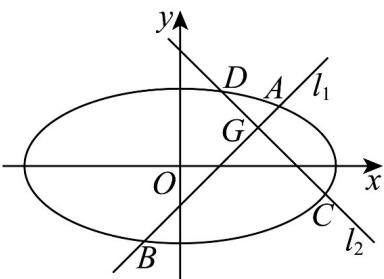

> [!faq]- 《专题10_椭圆标准方程及其性质全方位总结_九大题型__高效培优期中专项》官方解析
>
> > [!success]- **【答案】** (1) $\frac{x^{2}}{16}+\frac{y^{2}}{4}=1$ (2) $k_{1}+k_{2}=0$
>
> > [!note]- **【分析】**
> > （ $^{1}$ ）利用相关点法直接求轨迹方程；
> >
> > (2) 设 $AB: y - 1 = k_{1}(x - 2)$ ，联立直线与椭圆方程，结合韦达定理可得 $\left|GA\right| \cdot \left|GB\right|$ ，同理可得 $\left|GC\right| \cdot \left|GD\right|$ ，化简可得 $k_{1} + k_{2}$ 的值.
>
> > [!note]- **【解析】**
> > （1）设 $M$ 的坐标为 $(x', y')$ ， $P$ 的坐标为 $(x, y)$ ，则 $\left\{ \begin{array}{l} x' = x \\ y' = 2y \end{array} \right.$
> >
> > 又点 $M\left(x^{\prime},y^{\prime}\right)$ 在圆 $O$ 上，即 $\left(x^{\prime}\right)^{2} + \left(y^{\prime}\right)^{2} = 16$
> >
> > 亦即 $\left(x\right)^2 + (2y)^2 = 16$ ，化简得： $\frac{x^2}{16} + \frac{y^2}{4} = 1$ 。
> >
> > (2)
> >
> > 
> >
> > 设 $A(x_{1},y_{1}),B(x_{2},y_{2})\quad AB$ 所在的直线方程为： $y - 1 = k_{1}(x - 2)$ ，联立得： $\left\{ \begin{array}{l}y - 1 = k_1(x - 2)\\ \frac{x^2}{16} +\frac{y^2}{4} = 1 \end{array} \right.$ ，消去得：
> >
> > $$
> > \left(1 + 4 k _ {1} ^ {2}\right) x ^ {2} + 8 k _ {1} \left(1 - 2 k _ {1}\right) x + 4 \left(1 - 2 k _ {1}\right) ^ {2} - 1 6 = 0
> > $$
> >
> > $$
> > x _ {1} + x _ {2} = - \frac {8 k _ {1} (1 - 2 k _ {1})}{1 + 4 k _ {1} ^ {2}} = - \frac {8 k _ {1} - 1 6 k _ {1} ^ {2}}{1 + 4 k _ {1} ^ {2}}, x _ {1} x _ {2} = \frac {4 (1 - 2 k _ {1}) ^ {2} - 1 6}{1 + 4 k _ {1} ^ {2}} = \frac {1 6 k _ {1} ^ {2} - 1 6 k _ {1} - 1 2}{1 + 4 k _ {1} ^ {2}}
> > $$
> >
> > $$
> > \left| G A \right| \cdot \left| G B \right| = \sqrt {\left(x _ {1} - 2\right) ^ {2} + \left(y _ {1} - 1\right) ^ {2}} \cdot \sqrt {\left(x _ {2} - 2\right) ^ {2} + \left(y _ {2} - 1\right) ^ {2}}
> > $$
> >
> > $$
> > = \sqrt {\left(x _ {1} - 2\right) ^ {2} + \left[ k _ {1} \left(x _ {1} - 2\right) \right] ^ {2}} \cdot \sqrt {\left(x _ {2} - 2\right) ^ {2} + \left[ k _ {1} \left(x _ {2} - 2\right) \right] ^ {2}} = \left(1 + k _ {1} ^ {2}\right) | x _ {1} - 2 | | x _ {2} - 2 |
> > $$
> >
> > $$
> > = \left(1 + k _ {1} ^ {2}\right) \left| \left(x _ {1} - 2\right) \left(x _ {2} - 2\right) \right| = \left(1 + k _ {1} ^ {2}\right) \left| x _ {1} x _ {2} - 2 \left(x _ {1} + x _ {2}\right) + 4 \right|
> > $$
> >
> > $$
> > = \left(1 + k _ {1} ^ {2}\right) \left| \frac {4 \left(1 - 2 k _ {1}\right) ^ {2} - 1 6}{1 + 4 k _ {1} ^ {2}} + 2 \frac {8 k _ {1} \left(1 - 2 k _ {1}\right)}{1 + 4 k _ {1} ^ {2}} + 4 \right| = \frac {8 \left(1 + k _ {1} ^ {2}\right)}{1 + 4 k _ {1} ^ {2}}
> > $$
> >
> > 同理： $\left|GC\right|\cdot\left|GD\right|=\frac{8\left(1+k_{2}^{2}\right)}{1+4k_{2}^{2}}$
> >
> > 由 $\left|GA\right|\cdot\left|GB\right|=\left|GC\right|\cdot\left|GD\right|$ 可得： $\left|\frac{8\left(1+k_{1}^{2}\right)}{1+4k_{1}^{2}}\right|=\frac{8\left(1+k_{2}^{2}\right)}{1+4k_{2}^{2}}$
> >
> > 化简： $k_{1}^{2} = k_{2}^{2}$ ，又 $k_{1}\neq k_{2}$ ，故： $k_{1} = -k_{2}$ ，即： $k_{1} + k_{2} = 0$
