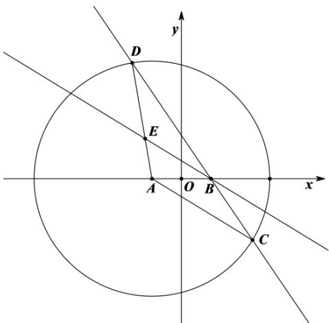

> [!faq]- 《专题10_椭圆标准方程及其性质全方位总结_九大题型__高效培优期中专项》官方解析
>
> > [!success]- **【答案】** (1)证明见解析， $\frac{x^{2}}{4}+\frac{y^{2}}{3}=1(y\neq0)$ (2) $3x + 2y - 4 = 0$
>
> > [!note]- **【分析】**
> > （1）由 $EB // AC$ ，得 $\angle EBD = \angle ACD$ ，进而得 $|EB| = |ED|$ ，所以 $|EA| + |EB| = |AD|$ ，根据圆的方程可得 $|EA| + |EB| = 4$ 。设点 $E$ 的坐标为 $(x, y)$ ，由两点间的距离公式可得 $\sqrt{(x + 1)^2 + y^2} + \sqrt{(x - 1)^2 + y^2} = 4$ ，化简可得所求方程。
> >
> > (2) 设弦的两端点分别为 $M(x_{1}, y_{1}), N(x_{2}, y_{2})$ ，结合条件，利用“点差法”，即可求解
>
> > [!note]- **【解析】**
> > （1）因为 $\left|AD\right| = \left|AC\right|$ ， $EB // AC$ ，故 $\angle EBD = \angle ACD = \angle ADC$
> >
> > 所以 $|EB| = |ED|$ ，故 $|EA| + |EB| = |EA| + |ED| = |AD|$
> >
> > 又圆 $A$ 的标准方程为 $\left(x + 1\right)^2 + y^2 = 16$ ，从而 $\left|AD\right| = 4$ ，所以 $\left|EA\right| + \left|EB\right| = 4$ 。
> >
> > 由题设得 $A(-1,0)$ ， $B(1,0)$ ， $\left|AB\right| = 2$
> >
> > 设点 $E(x,y)$ ，则有 $\sqrt{(x + 1)^2 + y^2} +\sqrt{(x - 1)^2 + y^2} = 4$ ，化简可得 $\frac{x^2}{4} +\frac{y^2}{3} = 1$
> >
> > 又由题意可得点 $E$ 不能在 $x$ 轴上，所以 $y \neq 0$ ，则点 $E$ 的轨迹方程为 $\frac{x^2}{4} + \frac{y^2}{3} = 1(y \neq 0)$ .
> >
> > 
> >
> > (2) 由 (1) 知，点 $E$ 的轨迹方程为 $\frac{x^2}{4} + \frac{y^2}{3} = 1(y \neq 0)$
> >
> > 由椭圆的对称性知，以 $P\left(1, \frac{1}{2}\right)$ 为中点的弦所在直线的斜率存在，
> >
> > 设弦的两端点分别为 $M(x_{1},y_{1}),N(x_{2},y_{2})$
> >
> > 则 $\frac{x_1^2}{4} +\frac{y_1^2}{3} = 1$ ①， $\frac{x_2^2}{4} +\frac{y_2^2}{3} = 1$ ②，
> >
> > 由①\_②，可得 $\frac{1}{4}\big(x_1 - x_2\big)(x_1 + x_2\big) + \frac{1}{3}\big(y_1 - y_2\big)(y_1 + y_2\big) = 0$
> >
> > 依题意， $x_{1} + x_{2} = 2,y_{1} + y_{2} = 1$ ，代入上式， $\frac{1}{2}\big(x_1 - x_2\big) + \frac{1}{3}\big(y_1 - y_2\big) = 0$
> >
> > 故有 $k_{MN}=\frac{y_{1}-y_{2}}{x_{1}-x_{2}}=-\frac{3}{2}$
> >
> > 故以 $P\left(1, \frac{1}{2}\right)$ 为中点的弦所在的直线方程为 $y - \frac{1}{2} = -\frac{3}{2}(x - 1)$ ，即 $3x + 2y - 4 = 0$
