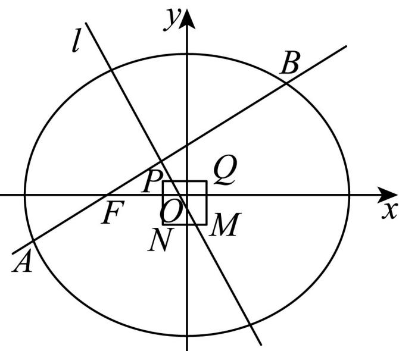

> [!faq]- 《专题10_椭圆标准方程及其性质全方位总结_九大题型__高效培优期中专项》官方解析
>
> > [!success]- **【答案】** (1) $C:\frac{x^{2}}{4}+\frac{y^{2}}{3}=1$ (2)① $k = 1$ ② $\left(\frac{1}{7}, \frac{\sqrt{2}}{8}\right]$
>
> > [!note]- **【分析】**
> > （1）根据题意求得 $a, b$ 即可得椭圆方程；
> >
> > (2) ①设直线 $AB: y = k(x + 1)$ ， $A(x_1, y_1), B(x_2, y_2)$ ，联立方程利用韦达定理求直线 $l$ 的方程，代入点 $P$ 运算求解即可；②根据直线 $l$ 的方程求直线 $l$ 与 $PN$ ， $QM$ 的交点坐标，结合题意可求得 $k - 1$ ，利用弦长公式整理可得 $\frac{s}{|AB|} = \frac{1}{28} \times \frac{4k^2 + 3}{k\sqrt{k^2 + 1}}$ ，利用换元法结合对勾函数求取值范围。
>
> > [!note]- **【解析】**
> > （1）设椭圆 C 的半焦距为 c > 0，
> >
> > 由题意可得： $\left\{\begin{aligned}c&=1\\ e&=\frac{c}{a}=\frac{1}{2}\\ a^{2}&=b^{2}+c^{2}\end{aligned}\right.$ ，解得 $\left\{\begin{aligned}c&=1\\ a&=2\\ b&=\sqrt{3}\end{aligned}\right.$ ，所以椭圆 $C:\frac{x^{2}}{4}+\frac{y^{2}}{3}=1$ (2)①因为 $F(-1,0)$ ，则直线 $AB:y=k(x+1)$ ， $A(x_{1},y_{1}),B(x_{2},y_{2})$ ，
> >
> > 联立方程 $\left\{\begin{aligned}y=k(x+1)\\ \frac{x^{2}}{4}+\frac{y^{2}}{3}=1\end{aligned}\right.$ ，消去y得 $(4k^{2}+3)x^{2}+8k^{2}x+4k^{2}-12=0$ ，
> >
> > 则 $\Delta=(8k^{2})^{2}-4(4k^{2}+3)(4k^{2}-12)=144(k^{2}+1)>0$ ，
> >
> > 可得 $x_{1}+x_{2}=-\frac{8k^{2}}{4k^{2}+3},x_{1}x_{2}=\frac{4k^{2}-12}{4k^{2}+3}$ ，
> >
> > 则 $\frac{x_{1}+x_{2}}{2}=-\frac{4k^{2}}{4k^{2}+3},\quad\frac{y_{1}+y_{2}}{2}=\frac{k(x_{1}+1)+k(x_{2}+1)}{2}=k\left(\frac{x_{1}+x_{2}}{2}+1\right)=\frac{3k}{4k^{2}+3}$ ，
> >
> > 即线段AB的中点为 $\left(-\frac{4k^{2}}{4k^{2}+3},\frac{3k}{4k^{2}+3}\right)$ ，
> >
> > 所以直线 $l:y-\frac{3k}{4k^{2}+3}=-\frac{1}{k}\left(x+\frac{4k^{2}}{4k^{2}+3}\right)$ ，即 $x+ky+\frac{k^{2}}{4k^{2}+3}=0$ ，
> >
> > 若直线l过点 $P\left(-\frac{2}{7},\frac{1}{7}\right)$ ，则 $-\frac{2}{7}+\frac{k}{7}+\frac{k^{2}}{4k^{2}+3}=0$ ，整理得 $(k-1)(4k^{2}+3k+6)=0$ 。
> >
> > 对于 $4k^{2}+3k+6=0$ ，则 $\Delta'=9-4\times4\times6=-87<0$ ，即 $4k^{2}+3k+6=0$ 无解，
> >
> > 由 $(k-1)(4k^{2}+3k+6)=0$ ，解得k=1。
> >
> > 
> > - **②**：由①可知：直线 $l: x + ky + \frac{k^2}{4k^2 + 3} = 0$ ，
> > 令 $x = -\frac{2}{7}$ ，可得 $y = \frac{2}{7k} - \frac{k}{4k^2 + 3}$ ，即直线 $l$ 与 $PN$ 的交点坐标为 $\left(-\frac{2}{7}, \frac{2}{7k} - \frac{k}{4k^2 + 3}\right)$ ，令 $x = \frac{1}{7}$ ，可得 $y = -\frac{1}{7k} - \frac{k}{4k^2 + 3}$ ，即直线 $l$ 与 $QM$ 的交点坐标为 $\left(\frac{1}{7}, -\frac{1}{7k} - \frac{k}{4k^2 + 3}\right)$ 由题意可得： $\begin{cases} -\frac{2}{7} \leq \frac{2}{7k} - \frac{k}{4k^2 + 3} \leq \frac{1}{7} \\ -\frac{2}{7} \leq -\frac{1}{7k} - \frac{k}{4k^2 + 3} \leq \frac{1}{7} \end{cases}$ ，解得 \_\_\_\_，可得 $|AB| = \sqrt{1 + k^2} \sqrt{\left(-\frac{8k^2}{4k^2 + 3}\right)^2 - 4 \times \frac{4k^2 - 12}{4k^2 + 3}} = \frac{12(k^2 + 1)}{4k^2 + 3}$ ，则 $\frac{s}{|AB|} = \frac{\frac{3\sqrt{k^2 + 1}}{7k}}{\frac{12(k^2 + 1)}{4k^2 + 3}} = \frac{1}{28} \times \frac{4k^2 + 3}{k\sqrt{k^2 + 1}}$ ，可得 $\left(\frac{4k^2 + 3}{k\sqrt{k^2 + 1}}\right)^2 = \frac{(4k^2 + 3)^2}{k^2(k^2 + 1)} = 16 + \frac{8k^2 + 9}{k^2(k^2 + 1)}$ ，令 $t = 8k^2 + 9, 17$ ，则 $k^2 = \frac{t - 9}{8}$ ，可得 $\frac{8k^2 + 9}{k^2(k^2 + 1)} = \frac{t}{\frac{t - 9}{8}\left(\frac{t - 9}{8} + 1\right)} = \frac{64}{t + \frac{9}{t} - 10}$ ，因为 $y = t + \frac{9}{t} - 10$ 在 $[17, +\infty)$ 内单调递增，且 $y|_{t=17} = \frac{128}{17}$ ，可得 $t + \frac{9}{t} - 10, \frac{128}{17}$ ，则 $\frac{8k^2 + 9}{k^2(k^2 + 1)} = \frac{64}{t + \frac{9}{t} - 10} \in \left(0, \frac{17}{2}\right]$ ，可得 $\left(\frac{4k^2 + 3}{k\sqrt{k^2 + 1}}\right)^2 = 16 + \frac{8k^2 + 9}{k^2(k^2 + 1)} \in \left(16, \frac{49}{2}\right)$ ，即 $\frac{4k^2 + 3}{k\sqrt{k^2 + 1}} \in \left(4, \frac{7\sqrt{2}}{2}\right]$ ，可得 $\frac{s}{|AB|} = \frac{1}{28} \times \frac{4k^2 + 3}{k\sqrt{k^2 + 1}} \in \left(\frac{1}{7}, \frac{\sqrt{2}}{8}\right]$ .
> >
> > 所以 $\frac{s}{|AB|}$ 的取值范围 $\left(\frac{1}{7},\frac{\sqrt{2}}{8}\right]$
