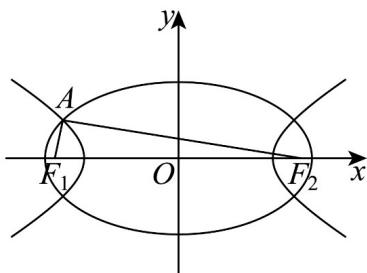

<!-- question-source:start -->
15. 如图，椭圆 $\frac{x^2}{6} + \frac{y^2}{2} = 1$ 和双曲线 $\frac{x^2}{3} - y^2 = 1$ 的公共焦点分别为 $F_1, F_2$ ， $A$ 是椭圆与双曲线的一个交点，则 $\left|AF_1\right| \cdot \left|AF_2\right| =$ \_\_\_\_.

<!-- question-source:end -->

![[高中/课堂同步/题库/人教A版高中数学同步讲义(2026)/03_选择性必修第一册/期中专项训练+期中模拟卷/专项训练/专题11_双曲线标准方程及其性质全方位总结_十大题型__高效培优期中专/_compact/answers/Q00062501A1.md]]
