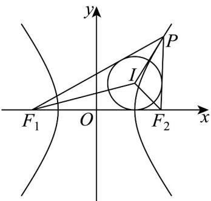

<!-- question-source:start -->
23. 已知点 $P$ 为双曲线 $\frac{x^2}{a^2} - \frac{y^2}{b^2} = 1 (a > 0, b > 0)$ 右支上一点， $F_1$ ， $F_2$ 分别为双曲线的左右焦点，且 $\left|F_1F_2\right| = \frac{4b^2}{3a}$ ， $I$ 为 $\triangle PF_1F_2$ 的内心，若 $S_{\triangle PF_1I} = S_{\triangle IPF_2} + \lambda S_{\triangle IF_1F_2}$ ，则 $\lambda$ 的值为（）

A. $\sqrt{2}$ B. $\frac{\sqrt{2}}{2}$ C. $\frac{1}{2}$ D. $\frac{1}{3}$
<!-- question-source:end -->

![[高中/课堂同步/题库/人教A版高中数学同步讲义(2026)/03_选择性必修第一册/期中专项训练+期中模拟卷/专项训练/专题11_双曲线标准方程及其性质全方位总结_十大题型__高效培优期中专/_compact/answers/Q00062508A1.md]]
