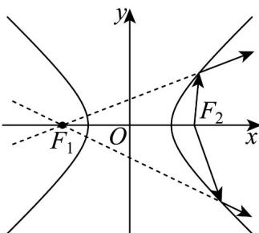
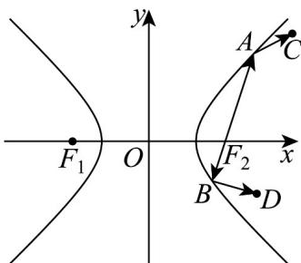

<!-- question-source:start -->
27. 如图 1 所示，双曲线具有光学性质：从双曲线右焦点发出的光线经过双曲线镜面反射，其反射关线的反向延长线经过双曲线的左焦点。设 $a > 0$ ，若双曲线 $E: \frac{x^2}{a^2} - \frac{y^2}{8} = 1$ 的左，右焦点分别为 $F_1, F_2$ ，从 $F_2$ 发出的光线经过图 2 中的 $A, B$ 两点反射后，分别经过点 $C, D$ ， $\cos \angle BAC = -\frac{3}{5}, AB \perp BD$ ，则 $a$ 的值为 \_\_\_\_。

图1

图2
<!-- question-source:end -->

![[高中/课堂同步/题库/人教A版高中数学同步讲义(2026)/03_选择性必修第一册/期中专项训练+期中模拟卷/专项训练/专题11_双曲线标准方程及其性质全方位总结_十大题型__高效培优期中专/_compact/answers/Q00062512A1.md]]
