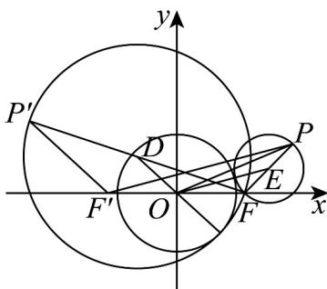
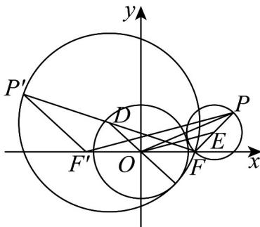

> [!faq]- 《专题11_双曲线标准方程及其性质全方位总结_十大题型__高效培优期中专》官方解析
>
> > [!success]- **【答案】** A
>
> > [!note]- **【分析】**
> > 根据两圆相切的条件，结合双曲线的定义求轨迹方程·
>
> > [!note]- **【解析】**
> > 由已知圆 $O$ 半径为 $\sqrt{3}$ ，如图，当两圆外切时，设 $PF$ 的中点为 $E$ ，即为圆心，
> >
> > 
> >
> > ，即
> >
> > $$
> > \mid E O \mid = \mid E F \mid + \sqrt {3}
> > $$
> >
> > $$
> > | E O | - | E F | = \sqrt {3}
> > $$
> >
> > 取 $F^{\prime}(-2,0)$ ，连接 $F^{\prime}P$ ， $O$ 是 $FF^{\prime}$ 中点，则 $\left|PF^{\prime}\right| = 2\left|OE\right|$
> >
> > 因此 $\left|PF'\right|-\left|PF\right|=2\left|OE\right|-2\left|EF\right|=2\sqrt{3}$
> >
> > 当两圆内切时，记动点为 $P'$ ， $FP'$ 的中点为 D，
> >
> > 
> >
> > 则 $|DO|=|DF|-\sqrt{3}$ ，所以 $|DF|-|DO|=\sqrt{3}$
> >
> > 因为点 $D$ 、 $O$ 分别是 $P^{\prime}F$ 、 $F^{\prime}F$ 的中点，所以 $\left|P^{\prime}F\right| = 2\left|DF\right|,\left|P^{\prime}F^{\prime}\right| = 2\left|DO\right|$
> >
> > 所以 $\left|P^{\prime}F\right| - \left|P^{\prime}F^{\prime}\right| = 2\left|DF\right| - 2\left|DO\right| = 2\sqrt{3}$
> >
> > 所以动点 $P$ 满足 $\| PF\| -|PF\| = 2\sqrt{3}$ ，而 $\left|FF'\right| = 4 > 2\sqrt{3}$
> >
> > 所以点 P 轨迹是以 F ， $F'$ 为焦点，实轴长为 $2\sqrt{3}$ 的双曲线，
> >
> > $2a = 2\sqrt{3}$ ，则 $a = \sqrt{3}$ ，又 $c = 2$ ，因此 $b = \sqrt{4 - 3} = 1$
> >
> > 双曲线方程为 $\frac{x^{2}}{3}-y^{2}=1$ ，
> >
> > 故选 **A**.
