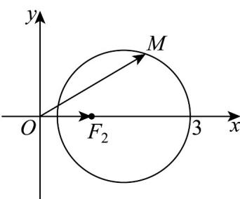

> [!faq]- 《专题11_双曲线标准方程及其性质全方位总结_十大题型__高效培优期中专》官方解析
>
> > [!success]- **【答案】** AD
>
> > [!note]- **【分析】**
> > 根据选项中的 $\left|MF_{1}\right|,\left|MF_{2}\right|$ 的关系，列出关于x,y的等式，分析等式的几何意义即可求解.
>
> > [!note]- **【解析】**
> > 对于 A，因为 $\left|MF_{1}\right|+\left|MF_{2}\right|=2=\left|F_{1}F_{2}\right|$ ，所以 M 的轨迹为线段 $F_{1}F_{2}$ ，
> >
> > 从而 M 的轨迹的长度等于 $^{2}$ ，故 A 正确；
> >
> > 对于 B，因为 $\left|MF_{1}\right|-\left|MF_{2}\right|=1$
> >
> > 由双曲线的定义，知 $M$ 的轨迹是以 $F_{1}, F_{2}$ 为焦点的双曲线的右支，
> >
> > 而选项中的方程中未限制范围，故 $^{B}$ 错误；
> >
> > 对于 C，由 $\left|MF_{1}\right|\cdot\left|MF_{2}\right|=4$ ，得 $\sqrt{(x+1)^{2}+y^{2}}\cdot\sqrt{(x-1)^{2}+y^{2}}=4$ ，
> >
> > 化简，得 $\left(x^{2} + y^{2} + 1\right)^{2} - 4x^{2} = 16$ ，联立 $\left\{ \begin{array}{l} \left(x^{2} + y^{2} + 1\right)^{2} - 4x^{2} = 16 \\ x^{2} + y^{2} = 6 \end{array} \right.$ ，方程组无解，
> >
> > 所以 $M$ 的轨迹与圆 $x^{2} + y^{2} = 6$ 没有交点，故 $\mathbb{C}$ 错误；
> >
> > 对于 D，由 $\frac{\left|MF_{1}\right|}{\left|MF_{2}\right|}=2$ ，得 $\sqrt{(x+1)^{2}+y^{2}}=2\sqrt{(x-1)^{2}+y^{2}}$ ，
> >
> > 化简得 $\left(x-\frac{5}{3}\right)^{2}+y^{2}=\frac{16}{9}$ ，所以M的轨迹是以 $\left(\frac{5}{3},0\right)$ 为圆心，半径为 $\frac{4}{3}$ 的圆， $\overline{OM} \cdot \overline{OF}_{2}$ 等于 OM 在 x 轴上的投影的长度，由图知其最大值为 $^{3}$ ，故 D 正确.
> >
> > 
> >
> > 故选 **AD**
