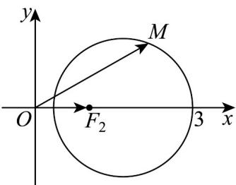

> [!faq]- 《专题11_双曲线标准方程及其性质全方位总结_十大题型__高效培优期中专》官方解析
>
> > [!success]- **【答案】** ACD
>
> > [!note]- **【分析】**
> > 对于 A，确定 M 点轨迹，即可判断；对于 B，结合双曲线定义进行判断；对于 C，求出 M 点轨迹方程，联立方程或利用向量数量积判断与圆的交点情况，即可判断；对于 D，求出动点 M 的轨迹方程，进而求解数量积最值，即可判断。
>
> > [!note]- **【解析】**
> > 选项 A：因为 $\left|MF_{1}\right|+\left|MF_{2}\right|=2=\left|F_{1}F_{2}\right|$ ，所以 M 的轨迹为线段 $F_{1}F_{2}$ ，
> >
> > 从而 $M$ 的轨迹的长度等于2，故 $\mathsf{A}$ 正确；
> >
> > 选项B：因为 $\left|MF_1\right| - \left|MF_2\right| = 1$ ，由双曲线的定义知， $M$ 的轨迹是以 $F_{1}, F_{2}$ 为焦点的双曲线的右支，
> >
> > 而结论的方程中未限制范围，故 $^{B}$ 错误；（由c=1,2a=1，得M的轨迹方程为 $4x^{2}-\frac{4y^{2}}{3}=1(x>0)$ ）
> >
> > 选项 C：
> > 解法一：由 $\left|MF_{1}\right|\cdot\left|MF_{2}\right|=4$ ，得 $\sqrt{(x+1)^{2}+y^{2}}\cdot\sqrt{(x-1)^{2}+y^{2}}=4$
> >
> > 化简得， $\left(x^{2} + y^{2} + 1\right)^{2} - 4x^{2} = 16$ ，联立 $\left\{ \begin{array}{l} \left(x^{2} + y^{2} + 1\right)^{2} - 4x^{2} = 16 \\ x^{2} + y^{2} = 6 \end{array} \right.$ ，得 $x^{2} = \frac{33}{4} > 6$
> >
> > 这与 $x^{2} \leq 6$ 矛盾，所以方程组无解，故 $M$ 的轨迹与圆 $x^{2} + y^{2} = 6$ 没有交点，故 $C$ 正确；
> >
> > 解法二：若有交点 $M(x,y)$ ，则 $\overline{MF_1}\cdot \overline{MF_2} = (-1 - x, - y)\cdot (1 - x, - y) = x^2 +y^2 -1 = 5$
> >
> > 又 $\overline{MF_{1}}\cdot\overline{MF_{2}}=\left|\overline{MF_{1}}\right|\cdot\left|\overline{MF_{2}}\right|\cos\overline{MF_{1}},\overline{MF_{2}}=4\left|\cos\overline{MF_{1}},\overline{MF_{2}}\right|\leq4$ ，矛盾，
> >
> > 所以 M 的轨迹与圆 $x^{2} + y^{2} = 6$ 没有交点，故 C 正确；
> >
> > 选项D：
> >
> > 解法一：由 $\frac{|MF_1|}{|MF_2|} = 2$ 得， $\sqrt{(x + 1)^2 + y^2} = 2\sqrt{(x - 1)^2 + y^2}$ ，
> >
> > 化简得 $\left(x-\frac{5}{3}\right)^{2}+y^{2}=\frac{16}{9}$ ，
> >
> > 所以 $M$ 的轨迹是以 $\left(\frac{5}{3},0\right)$ 为圆心，半径为 $\frac{4}{3}$ 的圆，
> >
> > $OM \cdot OF_{2}$ 等于 $OM$ 在 x 轴上的投影的长度，
> >
> > 由图知其最大值为 $^{3}$ ，故 $^{D}$ 正确；
> >
> > 
> >
> > 解法二：同法一得 $M$ 的轨迹是以 $\left(\frac{5}{3}, 0\right)$ 为圆心，半径为 $\frac{4}{3}$ 的圆，
> >
> > $\overline{OM} \cdot \overline{OF}_{2} = (x, y) \cdot (1, 0) = x$ ，由圆的方程知 x 可取到最大值 $^{3}$ ，故 D 正确；
> >
> > 解法三：由 $\frac{|MF_1|}{|MF_2|} = 2$ 得， $|MF_1| - |MF_2| = |MF_2| \leq |F_1F_2| = 2, |MO| \leq |OF_2| + |MF_2| \leq 3$
> >
> > 当 $M$ 在 $F_{2}F_{1}$ 的反向延长线上时取等号，
> > - **①**：$OM \cdot OF_{2} = |MO| \cos \angle MOF_{2} \leq |MO| \leq 3$
> > - **②**：当 M 在 $F_{2}F_{1}$ 的反向延长线上，且 $\left|MF_{2}\right|=2$ 时，
> >
> > 满足条件 $\frac{\left|MF_{1}\right|}{\left|MF_{2}\right|}=2$ ，此时 $OM\cdot OF_{2}=3$ ，
> >
> > 所以 $OM \cdot OF_{2}$ 的最大值为 3，故 D 正确；
> >
> > 故选 **ACD**。
