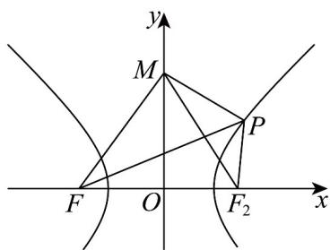

> [!faq]- 《专题11_双曲线标准方程及其性质全方位总结_十大题型__高效培优期中专》官方解析
>
> > [!success]- **【答案】** 3
>
> > [!note]- **【分析】**
> > 根据椭圆和双曲线的定义得到 $\left|AF_{1}\right|,\left|AF_{2}\right|$ 的方程组，由此可求 $\left|AF_{1}\right|,\left|AF_{2}\right|$ ，则 $\left|AF_{1}\right|\cdot\left|AF_{2}\right|$ 的结果可知.
>
> > [!note]- **【解析】**
> > 由椭圆定义可知： $\left|AF_{1}\right|+\left|AF_{2}\right|=2\sqrt{6}$ ，由双曲线定义可知： $\left|AF_{2}\right|-\left|AF_{1}\right|=2\sqrt{3}$
> >
> > 解得 $\left|AF_1\right| = \sqrt{6} -\sqrt{3},\left|AF_2\right| = \sqrt{6} +\sqrt{3}$ ，所以 $\left|AF_1\right|\cdot \left|AF_2\right| = 6 - 3 = 3$
> >
> > 故答案为：3·
> >
> > 16. 双曲线 $\frac{x^2}{a^2} - \frac{y^2}{b^2} = 1(a > 0, b > 0)$ 的左焦点为 $F(-3, 0)$ ， $M(0, 4)$ ，点 $P$ 为双曲线右支上的动点且 $\triangle MPF$ 周长的最小值为 $^{14}$ ，则双曲线的离心率为（）A. $\frac{3}{2}$ B. $2$ C. $\frac{5}{2}$ D. $3$
> >
> > 【答案】A
> >
> > 【分析】利用双曲线的定义将 $\left|MP\right|+\left|PF\right|$ 转化为 $\left|MP\right|+\left|PF_{2}\right|+2a$ ，然后利用三点共线时取最小值求解即可。
> > 【详解】∵ $F(-3,0), M(0,4)$ ，∴ $\left|MF\right|=5$ ∵△ MPF 周长的最小值为 14，
> > ∴ $\left|MF\right|+\left|MP\right|+\left|PF\right|$ 的最小值为 14，即 $\left|MP\right|+\left|PF\right|$ 的最小值为14-5=9，
> > 设右焦点为 $F_{2}(3,0)$ ，则 $\left|PF\right|-\left|PF_{2}\right|=2a$ ，即 $\left|PF\right|=\left|PF_{2}\right|+2a$ ，
> > 则 $\left|MP\right|+\left|PF\right|=\left|MP\right|+\left|PF_{2}\right|+2a$ $\left|MF_{2}\right|+2a$ ，即M,P, $F_{2}$ 三点共线且依次排列时等号成立，
> > 此时 $\left|MF_{2}\right|=\left|MF\right|=5$ ，即最小值为 $5+2a=9$ ，得2a=4，a=2，
> > ∵c=3，∴离心率 $e=\frac{c}{a}=\frac{3}{2}$
> >
> > 
> >
> > 故选 **A**.
