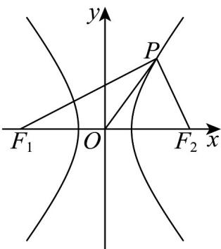

> [!faq]- 《专题11_双曲线标准方程及其性质全方位总结_十大题型__高效培优期中专》官方解析
>
> > [!success]- **【答案】** 4
>
> > [!note]- **【分析】**
> > 由题意，易知 $\triangle PF_{1}F_{2}$ 为直角三角形，根据勾股定理和双曲线的定义计算可得 $\left|F_1P\right|\left|F_2P\right| = 8$ ，结合三角形的面积公式计算即可求解：
>
> > [!note]- **【解析】**
> > 双曲线中 $a^2 = 16, e = \frac{c}{a} = \sqrt{1 + \frac{b^2}{a^2}} = \frac{\sqrt{5}}{2}$ ，解得 $b^2 = 4$ ，
> >
> > 所以 $c^2 = a^2 + b^2 = 20$ ，得 $c = 2\sqrt{5}$ ，所以 $\left|OP\right| = \left|F_1P\right| = \left|F_2P\right| = c$
> >
> > 故 $\triangle PF_{1}F_{2}$ 为直角三角形，得 $\left|F_1P\right|^2 +\left|F_2P\right|^2 = \left|F_1F_2\right|^2 = 4c^2 = 80$
> >
> > 由双曲线的定义知 $\left|F_{1}P\right|-\left|F_{2}P\right|=2a=8$
> >
> > 所以 $\left(\left|F_1P\right| - \left|F_2P\right|\right)^2 = \left|F_1P\right|^2 +\left|F_2P\right|^2 -2\left|F_1P\right|\left|F_2P\right| = 64$
> >
> > 得 $\left|F_{1}P\right|\left|F_{2}P\right|=8$ ，所以 $S_{\triangle PF_{1}F_{2}}=\frac{1}{2}\left|F_{1}P\right|\left|F_{2}P\right|=4$ .
> >
> > 故答案为：4
> >
> > 
