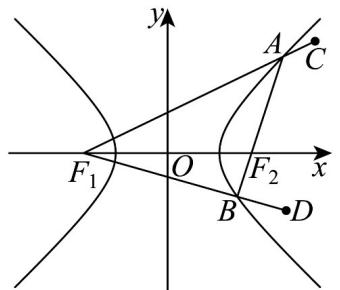

> [!faq]- 《专题11_双曲线标准方程及其性质全方位总结_十大题型__高效培优期中专》官方解析
>
> > [!success]- **【答案】** $^{3}$
>
> > [!note]- **【分析】**
> > 由双曲线的性质，结合双曲线的定义及勾股定理求解即可·
>
> > [!note]- **【解析】**
> > 由 $\cos\angle BAC=-\frac{3}{5}$ ， $AB\perp BD$ ，则 $\cos\angle BAF_{1}=\frac{3}{5}$ ， $\angle ABF_{1}=\frac{\pi}{2}$ ，
> >
> > 设 $\left|AF_1\right| = 5t$ ， $t > 0$ ，则 $\left|AB\right| = 3t$ ， $\left|BF_1\right| = 4t$
> >
> > 由双曲线定义得 $\left|AF_2\right| = 5t - 2a$ ， $\left|BF_2\right| = 4t - 2a$
> >
> > $\therefore 5t - 2a + 4t - 2a = 3t$ ，解得 $t = \frac{2}{3} a$
> >
> > 所以 $\left|BF_1\right| = \frac{8}{3} a$ ， $\left|BF_2\right| = \frac{2}{3} a$
> >
> > 在直角三角形 $BF_{1}F_{2}$ 中， $\left|BF_{1}\right|^{2}+\left|BF_{2}\right|^{2}=\left|F_{1}F_{2}\right|^{2}$
> >
> > 则 $\frac{64}{9} a^2 +\frac{4}{9} a^2 = 4c^2$ ，即 $17a^{2} = 9c^{2}$ ，又 $b^{2} = 8$
> >
> > $\therefore 17a^{2} = 9(a^{2} + 8)$ ，解得 $a = 3$
> >
> > 故答案为：3.
> >
> > 
