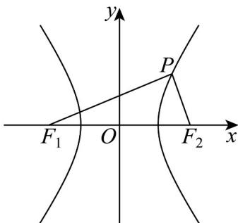

> [!faq]- 《专题11_双曲线标准方程及其性质全方位总结_十大题型__高效培优期中专》官方解析
>
> > [!success]- **【答案】** B
>
> > [!note]- **【分析】**
> > 先由 $\triangle F_{1}PF_{2}$ 的面积得 $\left|PF_1\right|\cdot \left|PF_2\right| = 8$ ，再由勾股定理结合双曲线的定义以及 $c^2 = a^2 +b^2$ 即可求解· 【详解】由题得 $S_{\triangle PF_1F_2} = \frac{1}{2}\left|PF_1\right|\cdot \left|PF_2\right| = 4$ ，所以 $\left|PF_1\right|\cdot \left|PF_2\right| = 8$ ，
>
> > [!note]- **【解析】**
> > 
> > 因为 $F_{1}P \perp F_{2}P$ ，所以 $\left|PF_{1}\right|^{2} + \left|PF_{2}\right|^{2} = (2c)^{2}$ ，
> > 则 $\left(\left|PF_1\right| - \left|PF_2\right|\right)^2 + 2\left|PF_1\right| \cdot \left|PF_2\right| = 4c^2$ ，所以 $4a^2 + 16 = 4c^2$ 即 $a^2 + 4 = c^2$ ，又 $c^2 = a^2 + b^2$ ，所以 $b^2 = 4$ 即 $b = 2$ 。
> >
> > 故选 **B**.
