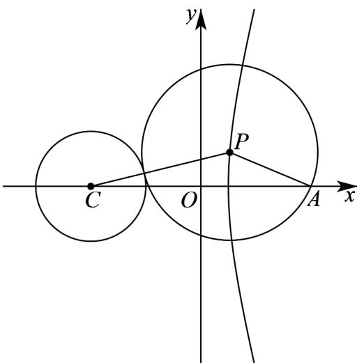

> [!faq]- 《专题11_双曲线标准方程及其性质全方位总结_十大题型__高效培优期中专》官方解析
>
> > [!success]- **【答案】** D
>
> > [!note]- **【分析】**
> > 根据动圆与定圆外切得出 $\left|PC\right|-\left|PA\right|=1<\left|AC\right|=4$ ，再由双曲线定义判断动点轨迹，写出方程即可。
>
> > [!note]- **【解析】**
> > 定圆的圆心为 $C(-2,0)$ ，与 $A(2,0)$ 关于原点对称
> > 设 $\left|PA\right|=r$ ，由两圆外切可得 $\left|PC\right|=1+r$ ，所以 $\left|PC\right|-\left|PA\right|=1<\left|AC\right|=4$
> >
> > 所以，点 P 的轨迹为双曲线的右支·
> >
> > 
> >
> > 设双曲线的方程为 $\frac{x^2}{a^2} -\frac{y^2}{b^2} = 1(a > 0,b > 0)$ ，则 $a = \frac{1}{2}$ ， $c = 2$ ， $b^{2} = c^{2} - a^{2} = \frac{15}{4}$
> >
> > 所以，点 $P$ 的轨迹方程为 $4x^{2} - \frac{4y^{2}}{15} = 1\left(x - \frac{1}{2}\right)$ .
> >
> > 故选 **D**.
