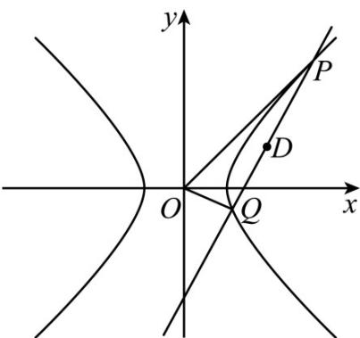

> [!faq]- 《专题11_双曲线标准方程及其性质全方位总结_十大题型__高效培优期中专》官方解析
>
> > [!success]- **【答案】** (1) $x^{2}-\frac{y^{2}}{4}=1(x\neq\pm1)$ (2) $2\sqrt{14}$
>
> > [!note]- **【分析】**
> > （1）设出动点坐标为 $(x,y)$ ，根据斜率之积为4列出等式，化简即可·
> >
> > (2) 首先直线斜率存在且经过点 $(0, -2)$ ，设出直线方程并将其与双曲线方程联立，由韦达定理结合已知条件算出斜率，进而由弦长的计算公式直接计算即可·
>
> > [!note]- **【解析】**
> > （1）设点 $M$ 的坐标为 $(x,y)$ ，因为 $k_{AM} = \frac{y}{x - 1}$ ， $k_{BM} = \frac{y}{x + 1}$ ，所以 $k_{AM} \cdot k_{BM} = \frac{y^2}{x^2 - 1} = 4$
> >
> > 化简得： $x^{2}-\frac{y^{2}}{4}=1$ 所以 E 的方程为 $x^{2}-\frac{y^{2}}{4}=1(x\neq\pm1)$ .
> >
> > (2) 当直线 $PQ$ 的斜率不存在时，显然不符合题意；
> >
> > 
> >
> > 设 $P(x_{1},y_{1})$ ， $Q(x_{2},y_{2})$ ，直线PQ方程为y=kx-2，
> >
> > $y = kx - 2$ 与 $x^{2} - \frac{y^{2}}{4} = 1$ 联立得： $(4 - k^{2})x^{2} + 4kx - 8 = 0$
> >
> > 由 $\Delta = 16k^2 +32(4 - k^2) > 0$ 且 $4 - k^{2}\neq 0$ ，解得 $k^2 < 8$ 且 $k^2\neq 4$
> >
> > 由韦达定理得 $\left\{ \begin{array}{l}x_{1} + x_{2} = \frac{4k}{k^{2} - 4}\\ x_{1}x_{2} = \frac{8}{k^{2} - 4} \end{array} \right.$
> >
> > 因为线段 PQ 中点 D 在第一象限，且纵坐标为 4，
> >
> > 所以 $\left\{ \begin{array}{l} x_{1} + x_{2} = \frac{4k}{k^{2} - 4} >0\\ y_{1} + y_{2} = k(x_{1} + x_{2}) - 4 = \frac{16}{k^{2} - 4} = 8 \end{array} \right.$ ，解得或（舍去）， $k = \sqrt{6}$ $k = -\sqrt{6}$
> >
> > 所以直线 $PQ$ 为 $y = \sqrt{6} x - 2$ ，所以 $\left\{ \begin{array}{l}x_{1} + x_{2} = 2\sqrt{6}\\ x_{1}x_{2} = 4 \end{array} \right.$
> >
> > 所以 $\left|PQ\right|=\sqrt{1+k^{2}}\cdot\left|x_{1}-x_{2}\right|=\sqrt{7}\cdot\sqrt{\left(x_{1}+x_{2}\right)^{2}-4x_{1}x_{2}}=2\sqrt{14}$
