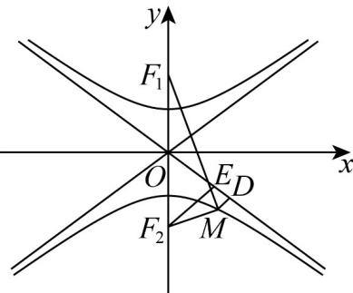
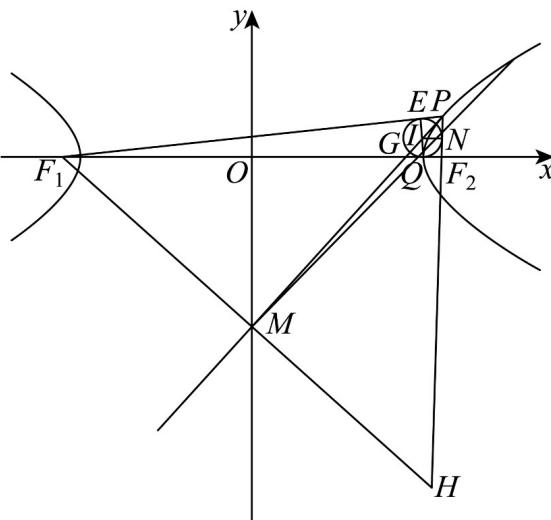

> [!faq]- 《专题11_双曲线标准方程及其性质全方位总结_十大题型__高效培优期中专》官方解析
>
> > [!success]- **【答案】** $\left(1,\frac{5}{3}\right)$
>
> > [!note]- **【分析】**
> > 根据题意画出草图，结合草图找到不等关系，再利用双曲线的离心率公式化简求范围·
>
> > [!note]- **【解析】**
> > 如图，过点 $F_{2}$ 作渐近线的垂线，垂足为E，
> >
> > 
> >
> > 设 $\left|F_1F_2\right| = 2c$ ，则点 $F_{2}$ 到渐近线 $y = \pm \frac{a}{b} x$ 的距离 $\left|EF_2\right| = \frac{bc}{\sqrt{a^2 + b^2}} = b$
> >
> > 由双曲线的定义可得 $\left|MF_1\right| - \left|MF_2\right| = 2a$ ，故 $\left|MF_1\right| = \left|MF_2\right| + 2a$
> >
> > 所以 $\left|MD\right|+\left|MF_{1}\right|=\left|MD\right|+\left|MF_{2}\right|+2a\geq\left|EF_{2}\right|+2a=b+2a$ ，即 $\left|MD\right|+\left|MF_{1}\right|$ 的最小值为 $2a+b$
> >
> > 因为 $\left|MD\right| > \left|F_1F_2\right| - \left|MF_1\right|$ 恒成立，所以 $\left|MD\right| + \left|MF_1\right| > \left|F_1F_2\right|$ 恒成立，即 $2a + b > 2c$ 恒成立，
> >
> > $$
> > b > 2 c - 2 a
> > $$
> >
> > $$
> > b ^ {2} > 4 c ^ {2} + 4 a ^ {2} - 8 a c
> > $$
> >
> > $$
> > c ^ {2} - a ^ {2} > 4 c ^ {2} + 4 a ^ {2} - 8 a c
> > $$
> >
> > 所以， $3c^{2}+5a^{2}-8ac<0$ ，即 $3e^{2}-8e+5<0$ ，解得 $1<e<\frac{5}{3}$ .
> >
> > 故答案为： $\left(1,\frac{5}{3}\right)$
> >
> > 43. 费马原理是几何光学中的一条重要定理，由此定理可以推导出双曲线的一些性质，例如，若点 $P$ 是双曲线 $C$ （ $F_{1}$ 、 $F_{2}$ 为 $C$ 的两个焦点）上的一点，则 $C$ 在点 $P$ 处的切线 $l$ 平分 $\angle F_{1}PF_{2}$ ·双曲线
> >
> > $C:\frac{x^2 - y^2}{a^2} -\frac{y^2}{5} = 1(a > 0)$ 的左、右焦点分别为 $F_{1}$ 、 $F_{2}$ ，右顶点 $_A$ 到一条渐近线的距离为 $_2$ ，右支上一动点 $_P$ 处的切线记为 $l$ ，则（ ）A.双曲线 $C$ 的离心率为 $\frac{\sqrt{5}}{2}$ B.当 $PF_{2}\perp x$ 轴时，则 $\triangle PF_1F_2$ 内切圆圆心横坐标为 $\sqrt{5}$ C.当 $PF_{2}\perp x$ 轴时，则 $l$ 与 $x$ 轴交点横坐标为4D.过点 $F_{1}$ 作 $F_{1}K\perp l$ ，垂足为 $K$ ， $\left|OK\right| = 2\sqrt{5}$
> >
> > 【答案】ACD
> >
> > 【分析】利用点到直线的距离公式求出 $a$ 的值，结合双曲线的离心率公式可判断 $\mathsf{A}$ 选项；利用切线长定理结合双曲线的定义可判断 $^{B}$ 选项；求出 $\left|PF_{2}\right|$ 、 $\left|PF_{1}\right|$ 的值，结合角平分线定理可判断 $^{C}$ 选项；利用延长 $F_{1}M$ 、 $PF_{2}$ 交于点H，利用双曲线的定义、中位线的性质可判断 $^{D}$ 选项.
> >
> > 【详解】对于 $^{A}$ 选项，双曲线C的渐近线方程为 $y=\pm\frac{\sqrt{5}}{a}x$ ，即 $\sqrt{5}x\pm ay=0$ ，
> >
> > 则点 $A(a,0)$ 到渐近线的距离为 $d = \frac{\left|\sqrt{5}a\right|}{\sqrt{5 + a^2}} = 2$ ，解得 $a = 2\sqrt{5}$
> >
> > 所以，双曲线 $C$ 的离心率为 $e = \frac{c}{a} = \sqrt{1 + \frac{b^2}{a^2}} = \sqrt{1 + \frac{5}{20}} = \frac{\sqrt{5}}{2}$ ，A对；
> >
> > 对于 $^{B}$ 选项，如下图所示：
> >
> > 
> >
> > 设 $\Delta PF_{1}F_{2}$ 的内切圆圆I分别切三边于点E、N、Q
> >
> > 由切线长定理可得 $\left|PE\right|=\left|PN\right|$ ， $\left|F_{1}E\right|=\left|F_{1}Q\right|$ ， $\left|F_{2}Q\right|=\left|F_{2}N\right|$ ，
> >
> > 所以 $\left|F_1F_2\right| + \left|PF_1\right| - \left|PF_2\right| = \left(\left|F_1Q\right| + \left|F_2Q\right|\right) + \left(\left|F_1E\right| + \left|PE\right|\right) - \left(\left|PN\right| + \left|F_2N\right|\right) = 2\left|F_1Q\right| = 2c + 2a$
> >
> > 所以 $\left|F_{1}Q\right|=x_{Q}-x_{F_{1}}=x_{Q}+c=c+a$ ，解得 $x_{Q}=a=2\sqrt{5}$ ，即 $\triangle PF_{1}F_{2}$ 内切圆圆心横坐标为 $2\sqrt{5}$ ，B 错；
> > 对于 C 选项，设直线 l 交 x 轴于点 G，由题意 $a=2\sqrt{5}$ ， $b=\sqrt{5}$ ，则 $c=\sqrt{a^{2}+b^{2}}=5$ ，
> >
> > 易知点 $F_{2}(5,0)$ ，将 $x = 5$ 代入双曲线 $C$ 的方程得 $\frac{25}{20} -\frac{y^2}{5} = 1$ ，解得 $y = \pm \frac{\sqrt{5}}{2}$ ，即 $\left|PF_2\right| = \frac{\sqrt{5}}{2}$
> >
> > 由双曲线的定义可得 $\left|PF_1\right| - \left|PF_2\right| = 2a = 4\sqrt{5}$ ，故 $\left|PF_1\right| = 4\sqrt{5} +\left|PF_2\right| = \frac{9\sqrt{5}}{2}$ 由角平分线定理得 $\frac{|F_1G|}{|F_2G|} = \frac{|PF_1|}{|PF_2|} = \frac{\frac{9\sqrt{5}}{2}}{\frac{\sqrt{5}}{2}} = 9$ ，故 $|F_1G| = \frac{9}{10}|F_1F_2| = \frac{9}{10} \times 2c = \frac{9}{5}c$ 即 $x_G + c = \frac{9}{5}c$ ，故 $x_G = \frac{4c}{5} = 4$ ，C对；
> > 对于D选项，延长 $F_1M$ 、 $PF_2$ 交于点H，因为 $F_1M \perp PM$ ，且 $\angle F_1PM = \angle HPM$ ，故 $|F_1M| = |HM|$ ，即M为 $F_1H$ 的中点， $|PH| = |PF_1|$ ，又因为O为 $F_1F_2$ 的中点，所以 $|OM| = \frac{1}{2}|F_2H| = \frac{1}{2}\left(|PH| - |PF_2|\right) = \frac{1}{2}\left(|PF_1| - |PF_2|\right) = a = 2\sqrt{5}$ ，D对.
> >
> > 故选 **ACD**.
