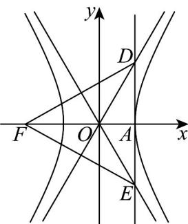

> [!faq]- 《专题11_双曲线标准方程及其性质全方位总结_十大题型__高效培优期中专》官方解析
>
> > [!success]- **【答案】** 2
>
> > [!note]- **【分析】**
> > 根据给定条件，求出双曲线 C 渐近线，进而求出 $\left|AD\right|$ ，再由正三角形的性质建立方程求出离心率。
>
> > [!note]- **【解析】**
> > 双曲线 $C: \frac{x^{2}}{a^{2}} - \frac{y^{2}}{b^{2}} = 1$ 的渐近线方程为 $y = \pm \frac{b}{a} x$ ，直线 DE 方程为 x = a，
> > 由对称性得 $\left|AD\right|=b$ ，令 $F(-c,0)$ ，则 $\left|AF\right|=c+a$ 由 $\triangle DEF$ 为等边三角形，得 $\left|AF\right|=\sqrt{3}\left|AD\right|$ ，即 $c+a=\sqrt{3}b=\sqrt{3}\cdot\sqrt{c^{2}-a^{2}}$ 解得 c = 2a ，所以 C 的离心率 $e = \frac{c}{a} = 2$ .
> >
> > 故答案为：2
> >
> > 
